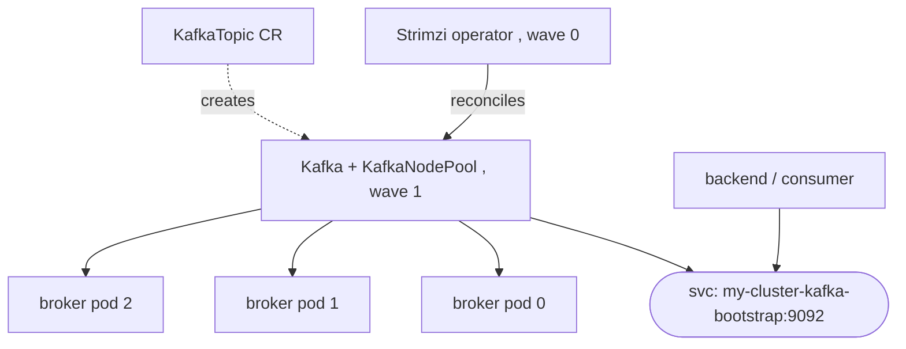

# Strimzi (Kafka Operator)

**Strimzi** is the CNCF (Incubating) operator for running Apache Kafka on Kubernetes. It's the standard Kafka path in the capstone (§3.3 CS3) now that the public Bitnami Kafka chart is deprecated ([Bitnami sourcing](deep:p3-bitnami-sourcing)). You install the operator (wave 0, [sync waves](deep:p3-sync-waves)), then declare a `Kafka` CR; Strimzi reconciles brokers, config, and routing.

**KRaft, not ZooKeeper.** Modern Strimzi runs Kafka in **KRaft** mode (Kafka's built-in Raft metadata quorum) — ZooKeeper is removed in current Kafka. Brokers and controllers are configured via `KafkaNodePool` CRs, with the top-level `Kafka` CR tying it together.

```yaml
apiVersion: kafka.strimzi.io/v1beta2
kind: KafkaNodePool
metadata:
  name: pool-a
  labels: { strimzi.io/cluster: my-cluster }
spec:
  replicas: 3
  roles: [controller, broker]      # KRaft roles
  storage:
    type: persistent-claim
    size: 100Gi
---
apiVersion: kafka.strimzi.io/v1beta2
kind: Kafka
metadata:
  name: my-cluster
  annotations: { strimzi.io/kraft: enabled, strimzi.io/node-pools: enabled }
spec:
  kafka:
    version: <pinned>
    listeners:
      - { name: plain, port: 9092, type: internal, tls: false }
    config:
      default.replication.factor: 3
      min.insync.replicas: 2
```

**Everything-as-a-CR.** Strimzi exposes the whole operational surface as custom resources, reconciled GitOps-style:

| CR | Manages |
|---|---|
| `Kafka` / `KafkaNodePool` | the cluster, brokers, controllers, listeners |
| `KafkaTopic` | topics (partitions, replication, retention) declaratively |
| `KafkaUser` | users + ACLs, issues credentials as a Secret |
| `KafkaConnect` / `KafkaConnector` | Connect cluster + connectors |
| `KafkaBridge` | HTTP↔Kafka bridge |



**The bootstrap Service.** Clients connect to `<cluster>-kafka-bootstrap:9092` (in-cluster, §1.7) — the same `kafka-bootstrap:9092` the backend (CS1) and the KEDA worker ([KEDA ScaledObject](deep:p3-keda-scaledobject)) reference. No Ingress on Kafka (§1.8, data service stays internal).

**vs raw StatefulSet.** Like Postgres (§3.3 CS2 vs CS3, [CloudNativePG](deep:p3-cloudnativepg)), you *could* StatefulSet Kafka, but you'd hand-build partition rebalancing, rolling broker upgrades, listener/TLS config, and topic management. Strimzi encodes all of that (§2.5).

**Gotchas:** `min.insync.replicas` + producer `acks=all` are what actually guarantee durability — replication factor alone doesn't; KRaft migration from old ZK clusters is a one-way, version-gated process; storage is per-broker (`persistent-claim`) and not easily shrunk; consumer parallelism is capped by **partition count** (ties to KEDA `maxReplicaCount`). Pin the Kafka `version` and verify current Strimzi/Kafka versions against docs.

**Interview angle:** "Run Kafka on K8s in 2026?" Strimzi operator, KRaft mode (no ZooKeeper), topics/users as CRs, clients hit the bootstrap Service; partitions cap consumer scale.
