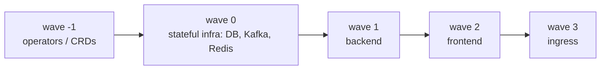

# Sync Waves vs Runtime Readiness

`argocd.argoproj.io/sync-wave: "N"` orders resources **within a single sync**. ArgoCD groups all resources by wave (default `0`; negatives allowed), applies the lowest wave first, **waits until every resource in that wave is Healthy**, then proceeds (§2.6, §3.2). Lower numbers go first; ties break by kind/name.

**Why operators get a negative/low wave.** An operator must install its **CRDs** before any custom resource (a Postgres `Cluster`, a `Kafka`) can be applied — otherwise the CR apply fails "no matches for kind." So: operator (wave 0) → its CR (wave 1) → consumers (§2.5, [CloudNativePG](deep:p3-cloudnativepg), [Strimzi](deep:p3-strimzi)).

**Health gating is the real ordering force.** A wave doesn't advance until resources report Healthy via ArgoCD's health checks (Deployments = available replicas; CRs = the operator's status conditions, if a health check exists). For custom resources **without** a registered health assessment, ArgoCD may consider them Healthy immediately — so the next wave starts before the DB is truly ready. This is the subtle failure mode.

**Waves order DEPLOY, not RUNTIME.** Kubernetes has no `depends_on` between Deployments. After sync completes, pods can still restart, the DB can fail over, Kafka can rebalance. So:

| Concern | Tool |
|---|---|
| Apply ordering at sync time | sync waves |
| "Don't start until X ready" at startup | `initContainer` (hard gate, e.g. wait-for-DB or migration) |
| Survive a dependency blipping later | app-level **retry/backoff** + readiness probes (§2.3) |

Design for **convergence**: the backend should boot, fail to reach the DB, crash/retry, and self-heal — not assume waves guarantee a live dependency.

**Waves vs phases.** Waves operate **inside** a phase. The full order is: PreSync hooks → Sync (wave 0,1,2…) → PostSync ([helm hooks](deep:p3-helm-hooks)). A `sync-wave` on a PreSync hook orders it among other PreSync hooks only — it cannot push a Sync resource ahead of a PreSync hook.

**Gotchas:** missing CR health check = premature wave advance (write a Lua health check or rely on the operator's readiness); huge negative/positive gaps don't matter (relative order only); a permanently-unhealthy resource **stalls the entire sync** at that wave (Progressing forever); `selfHeal` re-runs respect waves too.

**Interview angle:** "How do you ensure Postgres is ready before the backend?" Waves order the apply and ArgoCD waits for Healthy *if a health check exists* — but you still need backend retry, because waves order deploy, not runtime (§3.4 Q5).
