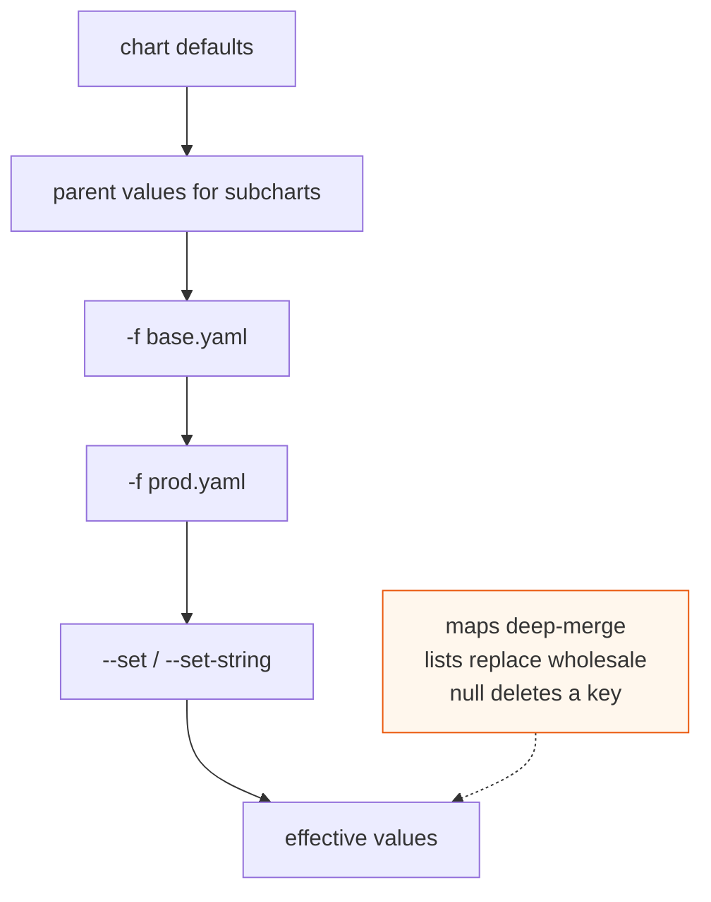

# Helm Values Precedence and Merge Edge Cases

The headline rule (§3.1): defaults → parent values for subcharts → `-f` files in order → `--set`. **Last wins.** The edge cases are where people get burned.

**Merge is deep for maps, replace for lists.** Two values files merging `resources: {limits: {cpu: ...}}` deep-merge key by key. But a *list* (e.g. `env:`, `args:`, `volumes:`) is **replaced wholesale** by the higher-precedence source — you cannot append one element via a second `-f`. This surprises everyone: setting `extraEnv: [{name: B}]` in `prod.yaml` does **not** add to `extraEnv: [{name: A}]` in the base; it overwrites it.

**`--set` type coercion.** `--set foo=1.4.0` may become a float or get mangled; `--set foo=true` becomes a bool. Use `--set-string foo=1.4.0` for versions/tags, or prefer a values file. `--set a.b.c=x` creates nested maps; commas split list items (`--set a={x,y}`), so values containing commas need escaping (`\,`). `--set-file` reads a file's contents as the value (certs, scripts). `--set-json` for structured input.

**Null deletes.** Setting a key to `null` in a higher-precedence file **removes** the inherited key rather than setting it to null — the documented way to "unset" a default from a base file.

**Subchart scoping.** A subchart `redis` reads `.Values` rooted at its **own** `values.yaml`. The parent overrides it under a top-level `redis:` key. `global:` is the one namespace shared *down* into every subchart — use it for cluster-wide things (domain, imageRegistry). A parent cannot reach *up* into a sibling subchart's values except via `global`.

**ArgoCD parallel.** A multi-source Application's `valueFiles` list applies in order, mirroring `-f` ordering ([argocd multi-source](deep:p3-argocd-multisource)). `helm.values`/`valuesObject` inline overrides apply on top, like `--set`. The "last source wins on duplicate *resources*" rule ([§2.6]) is a different mechanism (manifest dedup) but the same mental model.

**Debugging:** `helm template . -f a.yaml -f b.yaml` then diff; or `helm get values <release>` (only with `helm install`, empty under ArgoCD). Computed merge: there is no first-class "show me the merged values" beyond rendering.

**Gotchas:** list-replace vs map-merge is the silent killer; `--set` floats on version strings; forgetting `global:` is the only down-scope channel.

**Interview angle:** "Two `-f` files both set `env:` — does it merge?" Answer: no, lists replace; only maps deep-merge. Bonus: `null` to delete a default.
