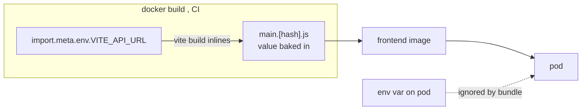

# The Vite Build-Time Env Gotcha and Runtime config.js

**The trap:** Vite inlines `import.meta.env.VITE_*` into the JavaScript bundle at **build time** (`vite build`). The values are string-substituted into the minified assets and shipped inside the image. Setting `VITE_API_URL` as an env var on the *running* frontend pod does **nothing** — the bundle was already frozen during `docker build`. This breaks the usual Kubernetes "configure via ConfigMap/env" model for SPAs.



**Three real fixes:**

**1. Runtime `config.js` injection (the classic).** Don't bake config. The container **entrypoint** runs `envsubst` over a template at startup, writing `/usr/share/nginx/html/config.js`:

```sh
# docker-entrypoint.sh (runs before nginx)
envsubst < /config.template.js > /usr/share/nginx/html/config.js
exec nginx -g 'daemon off;'
```

```js
// config.template.js  ->  config.js at runtime
window.__ENV__ = { API_URL: "${API_URL}" };
```

```html
<!-- index.html: load config.js BEFORE the bundle -->
<script src="/config.js"></script>
```

The app reads `window.__ENV__.API_URL` (with a build-time fallback). Now a ConfigMap/env drives the running pod — config is a **chart** concern again, fed via `envFrom` like the backend ([generic chart](deep:p3-generic-chart)).

**2. Same-origin `/api` routing (simplest).** Don't configure a backend URL at all. The SPA calls a **relative** `/api`, and the single Ingress routes `/api` → backend Service ([ingress ownership](deep:p3-ingress-ownership)). Nothing is baked; nothing is injected. This is why CS1/SETUP prefer it.

**3. Build per environment.** Bake at build time and produce one image per env. Works but defeats "one immutable artifact promoted across envs," so generally avoided.

**Why this matters for the chart story.** Because the only frontend-specific behavior (entrypoint writing `config.js`) lives in the **image**, the Helm chart treats the frontend like any other env-reading container — which is exactly why one [generic chart](deep:p3-generic-chart) serves both frontend and backend.

**Gotchas:** `config.js` must load **before** the bundle and must **not** be long-cached (cache-bust or `Cache-Control: no-store`) or stale config sticks; CSP must allow the inline/extra script; SSR/Next.js differs (server reads env at request time); forgetting the build-time fallback breaks local `vite dev`.

**Interview angle:** "Why doesn't setting `VITE_API_URL` on the pod work, and how do you make an SPA runtime-configurable?" Build-time inlining → runtime `config.js` via entrypoint `envsubst`, or sidestep with same-origin `/api`.
