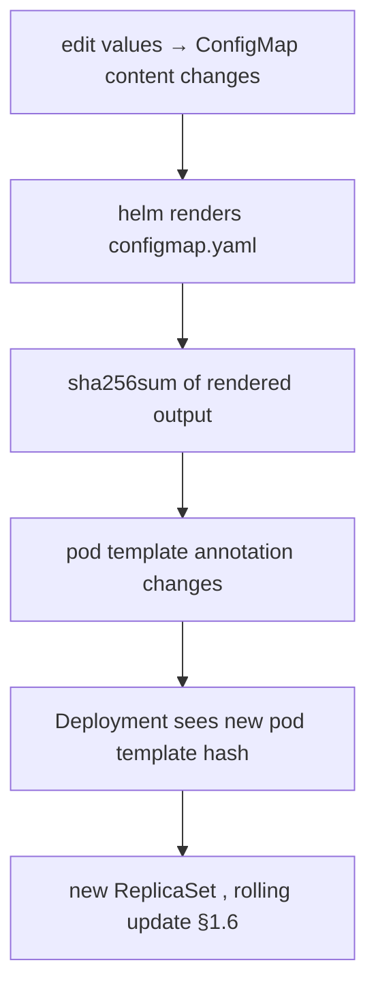

# The checksum/config rollout pattern

**Why:** changing a ConfigMap or Secret does **not** restart the pods that consume it. Env vars from `envFrom` are read **once at container start**; mounted config files update eventually but most apps don't re-read them. So you edit config, `helm upgrade`, and... nothing rolls. The [checksum annotation](deep:p2-checksum-annotation) forces it. See also [configmap reload](deep:p2-configmap-reload) for the live-reload alternative.

**The mechanism:** put a hash of the ConfigMap's rendered content into the pod template's annotations. When the config changes, the hash changes, the **pod template hash** changes, and the Deployment controller sees a new template → spins a new ReplicaSet → rolling update (§1.6). No config change = identical hash = no spurious rollout.

```yaml
# templates/deployment.yaml
spec:
  template:
    metadata:
      annotations:
        checksum/config: {{ include (print $.Template.BasePath "/configmap.yaml") . | sha256sum }}
        {{- if .Values.secret }}
        checksum/secret: {{ include (print $.Template.BasePath "/secret.yaml") . | sha256sum }}
        {{- end }}
```

`include` (not `template`) is required — only `include` returns a **string** you can pipe into `sha256sum` (§3.1 engine internals). `$.Template.BasePath` resolves the rendered configmap template regardless of where the chart lives.



**Why hash the rendered template, not the values:** two different value sets can render identical ConfigMaps (and vice versa with defaults). Hashing the **rendered output** means the rollout fires if and only if the actual config the pod sees changed — no false positives, no misses.

**Alternative — live reload (no restart):** tools like Reloader (watches ConfigMaps/Secrets, patches the Deployment) or an app that `inotify`-watches a mounted file ([configmap reload](deep:p2-configmap-reload)). Tradeoff: checksum is **declarative + GitOps-friendly** (the rollout is visible in the manifest diff, works under ArgoCD's `helm template` since it's pure render-time), whereas Reloader is an extra controller doing imperative patches that ArgoCD may then fight (drift).

**Gotchas:** mounted ConfigMaps *do* update on disk (eventually, with cache delay) but the **app must re-read** — most don't, so you still need the checksum or a reload mechanism; `envFrom`/`env` values are baked at start and **never** update without a pod restart; if the Secret is managed by an operator/ESO outside the chart, `$.Template.BasePath` can't hash it — annotate with the upstream's resourceVersion instead; under ArgoCD this works because it's render-time (no `lookup` needed).

**Interview angle:** "You changed a ConfigMap, pods still serve old config — why, and two ways to fix?" → env read once at start; checksum annotation (rollout) or Reloader/inotify (live reload).
