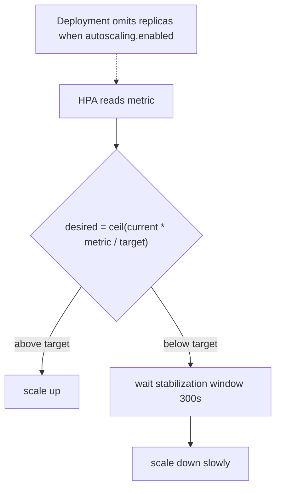

# HPA configuration in the chart

**Why:** the chart ships a **gated** `autoscaling/v2` HPA so any service can opt into horizontal scaling with a values flag. See [HPA algorithm](deep:p2-hpa-algorithm) for the control loop math; this is the chart-side config and the CPU-vs-custom decision.

**The gated template (autoscaling/v2):**

```yaml
{{- if .Values.autoscaling.enabled }}
apiVersion: autoscaling/v2
kind: HorizontalPodAutoscaler
metadata: { name: {{ include "app.fullname" . }} }
spec:
  scaleTargetRef: { apiVersion: apps/v1, kind: Deployment, name: {{ include "app.fullname" . }} }
  minReplicas: {{ .Values.autoscaling.minReplicas }}
  maxReplicas: {{ .Values.autoscaling.maxReplicas }}
  metrics:
    {{- if .Values.autoscaling.targetCPUUtilizationPercentage }}
    - type: Resource
      resource:
        name: cpu
        target: { type: Utilization, averageUtilization: {{ .Values.autoscaling.targetCPUUtilizationPercentage }} }
    {{- end }}
  behavior:                       # tame flapping
    scaleDown:
      stabilizationWindowSeconds: 300
{{- end }}
```

**Critical coupling: when HPA is on, the Deployment must NOT set `replicas`.** If both the chart and the HPA write `replicas`, they fight — every `helm upgrade`/ArgoCD sync resets it to the static value, then HPA scales it back, causing a flap. So the deployment template gates it:

```yaml
{{- if not .Values.autoscaling.enabled }}
replicas: {{ .Values.replicaCount }}
{{- end }}
```



**CPU vs custom/RPS — what to scale on:**

| Signal | Fits | Caveat |
|---|---|---|
| CPU % | CPU-bound request servers | measured **against request** — tiny request inflates % |
| memory | rarely good (doesn't shed on scale-up) | apps don't release memory |
| custom (RPS, latency) | I/O-bound, want SLO-driven | needs Prometheus Adapter / metrics API |
| external (queue lag) | workers | that's [KEDA](deep:p3-keda-scaledobject) territory (§3.3 CS4) |

CPU is the chart default because it needs no extra infrastructure (metrics-server only). RPS/latency scaling needs a custom-metrics adapter; queue-depth scaling is a job for KEDA, not a bare HPA.

**Gotchas:** HPA CPU% is relative to the **request** ([resources](deep:p4-resources-requests-limits)) — set requests sensibly or % is meaningless; no `metrics-server` → HPA shows `<unknown>` and never scales; min==max defeats the purpose; aggressive scale-down flaps — use a `stabilizationWindowSeconds`; HPA + static `replicas` = the fight above; HPA scales **pods**, not nodes — pair with Cluster Autoscaler/Karpenter or new pods stay Pending; readiness probes gate whether new pods take traffic during a scale-up (§1.7).

**Interview angle:** "You enabled HPA but replica count keeps snapping back on every deploy — why?" → the Deployment template still sets `replicas`; gate it out when autoscaling is enabled.
