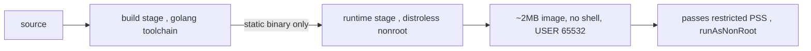

# Image hardening: distroless / scratch / Chainguard

**Why:** the image is the attack surface and it drives several chart fields ([securityContext](deep:p4-securitycontext) `runAsNonRoot` only works if the image has a non-root `USER`). A 5MB static binary has nothing to exploit; a full `ubuntu` ships a shell, package manager, and dozens of CVEs you'll never use.

**The base-image ladder:**

| Base | Size | Shell? | CVE surface | Non-root | Notes |
|---|---|---|---|---|---|
| `ubuntu`/`debian` | ~70-120MB | yes | high | manual | easy to debug, worst surface |
| `alpine` | ~5MB | yes (busybox) | low-ish | manual | musl libc can bite cgo/DNS |
| `gcr.io/distroless/static:nonroot` | ~2MB | **no** | minimal | **built-in (65532)** | Go static binaries |
| `scratch` | ~0 | no | ~zero | manual `USER` | needs CA certs + tzdata copied in |
| Chainguard `cgr.dev/chainguard/static` | tiny | no | near-zero, **0-CVE goal** | yes | Wolfi-based, daily rebuilds |

**Chart-relevant Dockerfile (Go, multi-stage, distroless nonroot):**

```dockerfile
FROM golang:1.24 AS build
WORKDIR /src
COPY . .
RUN CGO_ENABLED=0 GOOS=linux go build -trimpath -ldflags="-s -w" -o /app ./cmd/server

FROM gcr.io/distroless/static:nonroot
COPY --from=build /app /app
USER 65532:65532                 # nonroot UID baked in — makes runAsNonRoot work
EXPOSE 8080
ENTRYPOINT ["/app"]
```

`CGO_ENABLED=0` → fully static binary, so `distroless/static` (no libc) suffices. The numeric `USER` is what lets `runAsNonRoot: true` pass kubelet's check (it can verify a numeric UID is non-zero; a *named* user it cannot, and refuses to start).



**distroless/scratch vs alpine — the tradeoff:** distroless/scratch win on size + CVE surface + no-shell (can't `kubectl exec` a shell = harder for an attacker too). The cost: **debugging**. No shell means you debug with `kubectl debug` ephemeral containers instead of `exec sh`. Alpine keeps a shell but reintroduces busybox CVEs and musl quirks (DNS resolution, cgo).

**Gotchas:** `runAsNonRoot: true` + named/root `USER` → `CreateContainerConfigError`; `scratch` needs `/etc/ssl/certs/ca-certificates.crt` copied in or HTTPS calls fail with x509 errors, and `/etc/passwd`/tzdata too; distroless has no shell so `command: ["sh"]` debugging and shell-form `preStop` hooks don't work (use exec-form or `kubectl debug`); musl (alpine) can break `net` cgo resolver — set `GODEBUG=netdns=go` or go static; always pin by **digest** (`@sha256:…`) in prod, not floating tags.

**Interview angle:** "Why does `runAsNonRoot: true` fail on an image that 'looks' non-root?" → kubelet needs a *numeric* non-zero `USER`; a username it can't verify pre-start.
