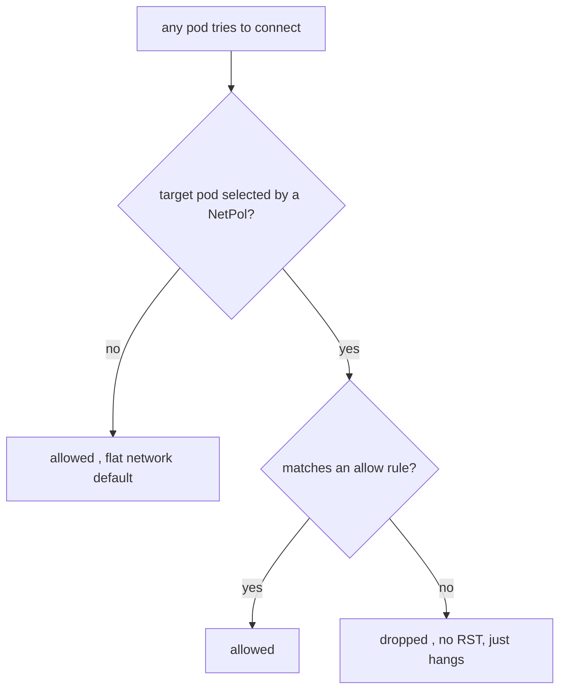

# NetworkPolicy in the chart (gated)

**Why:** the flat pod network has **no implicit isolation** (§1.1) — any compromised pod can reach every other pod and Service VIP until a [NetworkPolicy](deep:p1-network-policy) says otherwise. The chart ships a gated policy so a service can declare its own ingress/egress allow-list, moving toward zero-trust east-west.

**Default-deny + explicit allow is the only model that works.** A NetworkPolicy is *additive allow*: the moment **any** policy selects a pod, everything not explicitly allowed is denied for that direction. So the pattern is a default-deny policy plus narrow allows.

```yaml
{{- if .Values.networkPolicy.enabled }}
apiVersion: networking.k8s.io/v1
kind: NetworkPolicy
metadata: { name: {{ include "app.fullname" . }} }
spec:
  podSelector:
    matchLabels: {{- include "app.selectorLabels" . | nindent 6 }}
  policyTypes: [Ingress, Egress]
  ingress:
    - from:
        - podSelector: { matchLabels: { app.kubernetes.io/name: frontend } }
        # allow the ingress controller namespace too:
        - namespaceSelector: { matchLabels: { kubernetes.io/metadata.name: ingress-nginx } }
      ports:
        - { protocol: TCP, port: 8080 }
  egress:
    # MUST allow DNS or every name lookup fails
    - to:
        - namespaceSelector: { matchLabels: { kubernetes.io/metadata.name: kube-system } }
      ports:
        - { protocol: UDP, port: 53 }
        - { protocol: TCP, port: 53 }
    # then the specific backends this service talks to
    - to:
        - podSelector: { matchLabels: { app.kubernetes.io/name: postgres } }
      ports: [{ protocol: TCP, port: 5432 }]
{{- end }}
```



**The #1 self-inflicted outage: forgetting DNS egress.** Once you set `policyTypes: [Egress]`, *all* egress is denied except what you list — including the pod's lookups to CoreDNS on port 53. Symptom: every outbound connection hangs on name resolution (`web` can't resolve, per §1.9 Q10). Always allow UDP/TCP 53 to kube-system.

**Gotchas:** NetworkPolicy is **only enforced if the CNI supports it** (Calico/Cilium yes; some setups silently ignore it — a false sense of security); denied traffic **hangs/times out**, it doesn't RST, so failures look like app bugs; forgetting DNS egress breaks everything; `namespaceSelector` matches *namespace labels*, not names — rely on the auto `kubernetes.io/metadata.name` label; ingress-controller traffic comes *from the controller's namespace*, so allow it explicitly or external traffic dies; policies are **namespaced** and combine as a union of allows across all that select a pod.

**Interview angle:** "You applied an egress NetworkPolicy and the app can't reach *anything*, including its DB by name — what's the first thing to check?" → DNS egress (UDP/TCP 53 to CoreDNS) wasn't allowed; name resolution fails before any connection.
