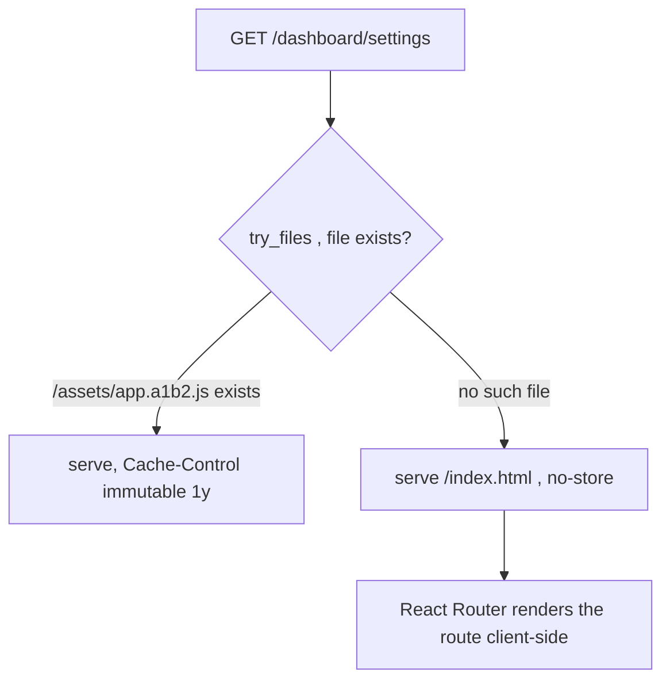

# nginx.conf for an SPA (history-mode fallback, caching, headers)

**Why:** a React/Vite SPA is *static files* plus one routing rule. Get the nginx config wrong and you get hard-refresh 404s, stale-forever bundles, or a perfectly cached `index.html` that never picks up new deploys. Served by **nginx-unprivileged** (listens on 8080, paths under `/tmp`) so it satisfies the restricted [securityContext](deep:p4-securitycontext).

**The four things the config must do:**

```nginx
server {
  listen 8080;                       # non-root port (nginx-unprivileged default)
  root /usr/share/nginx/html;
  index index.html;

  # 1. SPA history-mode fallback: unknown path → index.html, let the router handle it
  location / {
    try_files $uri $uri/ /index.html;
  }

  # 2. Hashed assets are immutable → cache forever
  location /assets/ {
    expires 1y;
    add_header Cache-Control "public, immutable";
  }

  # 3. index.html must NEVER cache, or clients pin to an old bundle
  location = /index.html {
    add_header Cache-Control "no-store, no-cache, must-revalidate";
  }

  # 4. health endpoint for the readiness probe
  location = /healthz { return 200 'ok'; add_header Content-Type text/plain; }

  gzip on;
  gzip_types text/css application/javascript application/json image/svg+xml;

  # security headers
  add_header X-Content-Type-Options nosniff;
  add_header X-Frame-Options DENY;
  add_header Referrer-Policy strict-origin-when-cross-origin;
}
```

This ships as a **ConfigMap** mounted over `/etc/nginx/conf.d/default.conf` so it's a chart/values concern, not baked into the image (and gets the [checksum rollout](deep:p4-helm-checksum-rollout) treatment).



**The caching split is the crux.** Vite emits content-hashed filenames (`app.a1b2c3.js`) — these can cache for a year because a content change *changes the name*. But `index.html` references those hashed names, so it must be `no-store`: a stale `index.html` points the browser at JS bundles that no longer exist → blank page after deploy. Immutable assets + non-cached index = instant, safe deploys.

**Gotchas:** miss `try_files` → deep links and hard refreshes 404 (the #1 SPA-on-nginx bug); cache `index.html` → users stuck on old app until they hard-refresh; gzip the wrong types or double-compress already-compressed assets wastes CPU; `add_header` inside a `location` **replaces** inherited headers (nginx quirk) — repeat them or use a map; the unprivileged image needs writable `/tmp`, `/var/cache/nginx` (`emptyDir`) under a read-only root FS ([securityContext](deep:p4-securitycontext)); CSP headers are powerful but break SPAs that inline scripts — test before enforcing.

**Interview angle:** "Hard-refresh on `/users/42` returns 404 but clicking there from the home page works — why?" → no `try_files … /index.html` fallback; the server has no such file, only the client router does.
