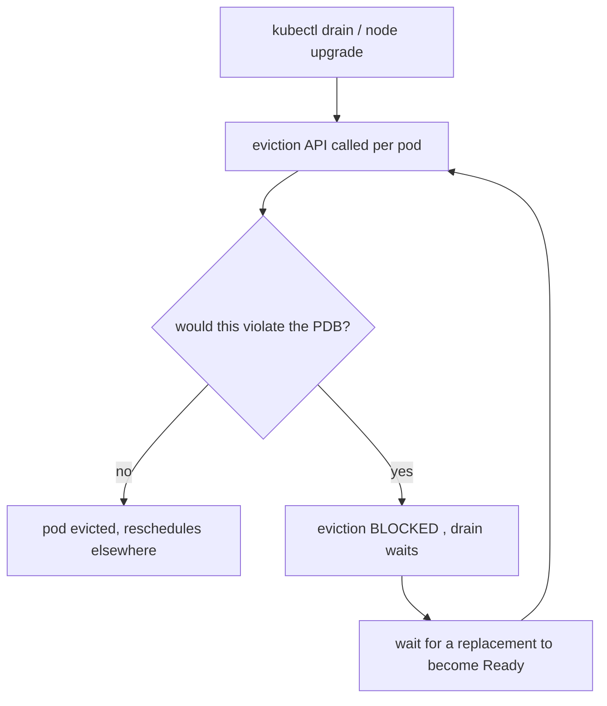

# PodDisruptionBudget in the chart

**Why:** a PDB protects availability during **voluntary** disruptions — node drains, cluster upgrades, autoscaler scale-down. Without one, `kubectl drain` (or a rolling node upgrade) can evict *all* your replicas at once. See [PodDisruptionBudget](deep:p2-poddisruptionbudget) for fundamentals; this is the chart config and the minAvailable-vs-maxUnavailable choice.

**Gated template:**

```yaml
{{- if .Values.pdb.enabled }}
apiVersion: policy/v1
kind: PodDisruptionBudget
metadata: { name: {{ include "app.fullname" . }} }
spec:
  {{- if .Values.pdb.minAvailable }}
  minAvailable: {{ .Values.pdb.minAvailable }}
  {{- else }}
  maxUnavailable: {{ .Values.pdb.maxUnavailable | default 1 }}
  {{- end }}
  selector:
    matchLabels: {{- include "app.selectorLabels" . | nindent 6 }}
{{- end }}
```

**minAvailable vs maxUnavailable — pick exactly one:**

| | minAvailable | maxUnavailable |
|---|---|---|
| Says | "keep ≥ N running" | "evict ≤ N at once" |
| Fixed-floor semantics | yes (`minAvailable: 2`) | no |
| Scales with replicas | use `%` | use `%` |
| Best for | small fixed pools where you know the floor | autoscaled pools (relative tolerance) |

For a fixed 3-replica service, `minAvailable: 2` is clearest ("never go below 2"). For an HPA'd pool whose size varies, `maxUnavailable: 1` or a percentage adapts. **Never set both** — the API rejects it.



**The deadlock trap:** `minAvailable` equal to (or above) `replicas` — e.g. `minAvailable: 3` with `replicas: 3` — means **zero** pods can ever be voluntarily evicted, so a node drain **hangs forever**. Always leave headroom: `minAvailable < replicas`. Same with `maxUnavailable: 0`. A single-replica deployment + any PDB = un-drainable node.

**Gotchas:** PDB only governs **voluntary** disruptions — a node *crash* ignores it entirely (that's what [topology spread](deep:p4-topology-spread) + replicas defend against); `minAvailable >= replicas` deadlocks drains; PDB selector must match the pods (reuse `selectorLabels`); a PDB with no matching pods is silently inert; pairs with a sensible rollout (§4 rollout) but they're *different* — rollout governs deploys, PDB governs node operations; with HPA, prefer `%`-based or `maxUnavailable` so it tracks the live replica count ([HPA config](deep:p4-hpa-config)).

**Interview angle:** "A node drain hangs forever during a cluster upgrade — what's the likely PDB misconfig?" → `minAvailable >= replicas` (or single replica + PDB); no eviction can satisfy it.
