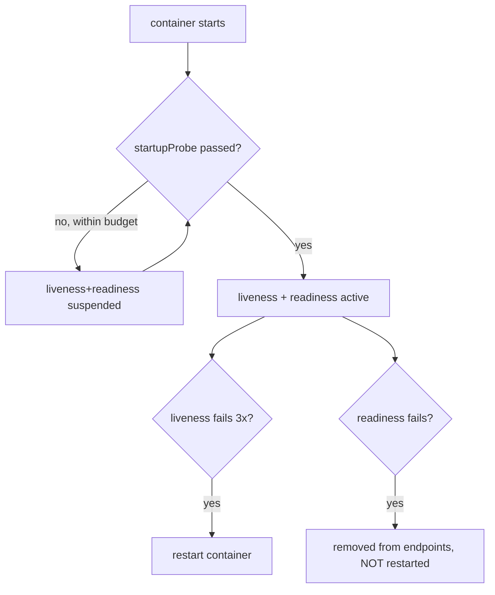

# Probe tuning (the chart's three probes)

**Why:** the three probes answer three different questions; conflating them causes restart loops and traffic to dead pods. See [probes](deep:p2-probes) for fundamentals — this is the *tuning* angle for the chart.

**What each one actually gates:**

| Probe | Question | On failure | Gates |
|---|---|---|---|
| **startup** | "has it finished booting?" | kill + restart after `failureThreshold` | suspends liveness+readiness until it passes once |
| **liveness** | "is it wedged, restart it?" | **restart container** | nothing but restart |
| **readiness** | "can it serve right now?" | remove from [endpoints](deep:p1-service-types) | Service traffic + rollout progress (§1.6) |

```yaml
startupProbe:                 # slow boot? this protects liveness during it
  httpGet: { path: /healthz, port: http }
  failureThreshold: 30        # 30 * 10s = 5min budget to boot
  periodSeconds: 10
livenessProbe:
  httpGet: { path: /healthz, port: http }
  periodSeconds: 10
  failureThreshold: 3
readinessProbe:
  httpGet: { path: /readyz, port: http }   # SEPARATE endpoint from liveness
  periodSeconds: 5
  failureThreshold: 3
```

**The single most important rule: liveness and readiness must use different endpoints.** Liveness `/healthz` = "the process is alive" (cheap, no dependencies). Readiness `/readyz` = "I can serve, including my dependencies (DB, cache)." If liveness checks the DB and the DB blips, K8s **restarts every pod simultaneously** — turning a transient outage into a full outage. Readiness should drop the pod from rotation; liveness should not.



**Why startup probe instead of big `initialDelaySeconds`:** `initialDelaySeconds` is a fixed guess applied to every probe forever; a startup probe gives a generous *boot budget* (`failureThreshold * periodSeconds`) that disappears once boot succeeds, then liveness can be aggressive. Best of both: tolerant boot, fast failure detection afterward.

**Gotchas:** liveness hitting a dependency = cascading restart storm (classic outage); readiness too lenient = rollout "completes" while serving 503s (§1.6); `failureThreshold * periodSeconds` must exceed real worst-case boot or you get a CrashLoop that never boots; `terminationGracePeriodSeconds` + a `preStop` sleep matters at shutdown so in-flight requests drain before SIGTERM (see [rollout strategy](deep:p4-rollout-strategy)); TCP probes only prove the port is open, not that the app works — prefer `httpGet`.

**Interview angle:** "Your DB has a 5s blip and *all* backend pods restart at once — what's misconfigured?" → liveness probe is checking a dependency; move that check to readiness.
