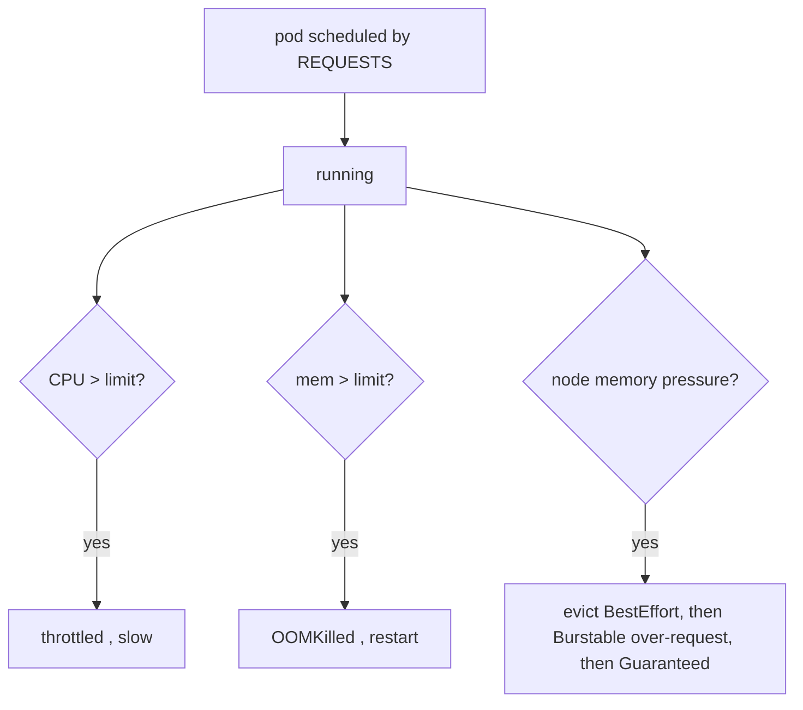

# Resources: requests, limits, and QoS

**Why:** requests drive **scheduling** (the scheduler sums requests to decide what fits); limits drive **enforcement** (throttling/OOM-kill at runtime). Get them wrong and you either waste nodes or get evicted under pressure.

**What:** `requests` = guaranteed floor reserved for the pod; `limits` = hard ceiling. The relationship between them sets the **QoS class**, which decides eviction order:

| QoS | Condition | Eviction priority |
|---|---|---|
| **Guaranteed** | every container: requests == limits (cpu+mem) | evicted **last** |
| **Burstable** | requests set, limits higher (or partial) | middle |
| **BestEffort** | nothing set | evicted **first** |

```yaml
resources:
  requests: { cpu: 100m, memory: 128Mi }
  limits:   { cpu: 500m, memory: 128Mi }   # mem == request → no mem-OOM surprises
```

**CPU vs memory limits behave differently — this is the crux:**

| | CPU limit hit | Memory limit hit |
|---|---|---|
| Behavior | **throttled** (CFS), app slows | **OOM-killed**, container restarts |
| Reversible? | yes, latency spike only | no, hard kill |
| Advice (2026) | **omit CPU limit** or set generously; always set request | **always set, request == limit** |

The modern consensus: set CPU **requests** for fair scheduling, but a tight CPU **limit** causes invisible throttling tail-latency even when the node is idle. Memory has no "throttle" — exceed it and you die — so memory request==limit gives predictable behavior.



**Why this chart defaults to request==memory-limit, CPU request only:** predictable OOM behavior, no idle throttling, and Burstable QoS so a pod can use idle CPU. For latency-critical singletons you may go full **Guaranteed** (all four equal) to win eviction protection — that's the `values-prod.yaml` knob.

**Gotchas:** no requests → BestEffort → first to die and can starve neighbors; the scheduler ignores *actual* usage, only requests, so under-requesting overcommits the node; `limits` without `requests` makes K8s set request=limit silently; CPU is compressible (throttle), memory is not (kill); cluster-wide `LimitRange`/`ResourceQuota` can reject pods that omit them. See [HPA config](deep:p4-hpa-config) — HPA's CPU% is measured **against the request**, so a tiny request makes utilization read artificially high.

**Interview angle:** "What QoS gives requests==limits and why does it matter at eviction time?" and "why might you deliberately *not* set a CPU limit?"
