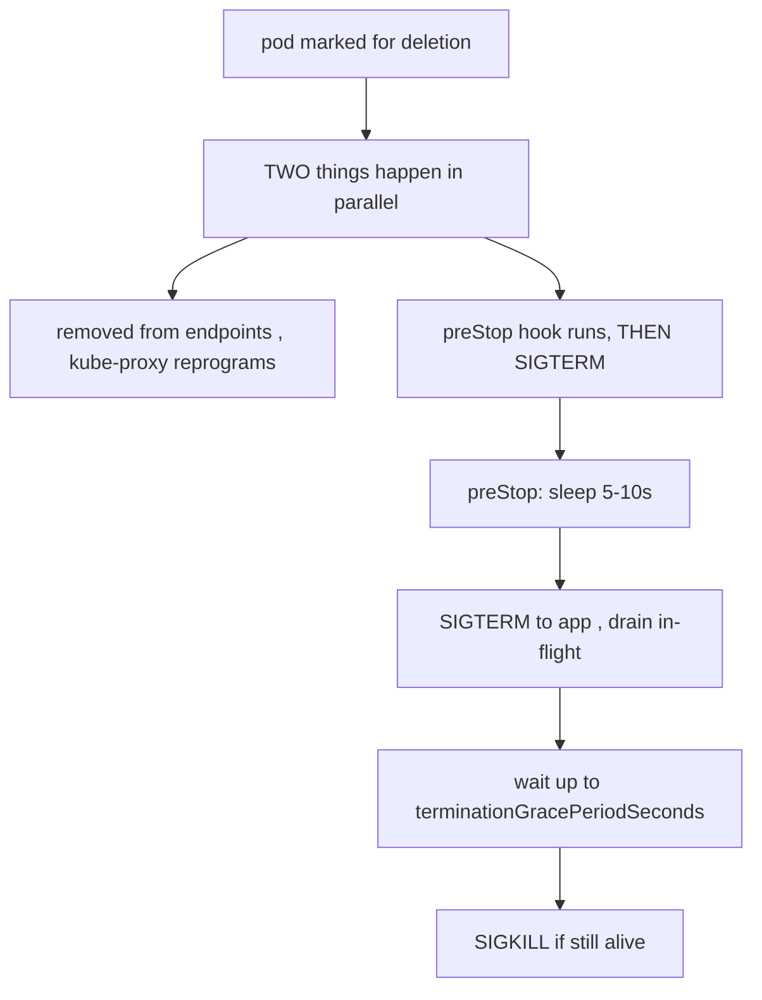

# Rollout strategy + graceful shutdown

**Why:** the default `RollingUpdate` is right for stateless web apps, but the *parameters* and the *shutdown path* decide whether a deploy is actually zero-downtime. See [rolling update math](deep:p1-rolling-update-math) for the surge/unavailable arithmetic; this covers the chart's choices.

**RollingUpdate vs Recreate:**

| | RollingUpdate (default) | Recreate |
|---|---|---|
| How | new RS up, old down, in batches | kill ALL old, then start new |
| Downtime | none (with readiness gating) | **yes**, a gap |
| Two versions live at once | yes | no |
| Use when | stateless HTTP services | schema-incompatible versions, singleton, RWO volume one-writer |

**Chart default:**

```yaml
strategy:
  type: RollingUpdate
  rollingUpdate:
    maxSurge: 25%          # rounds UP → can briefly exceed replicas
    maxUnavailable: 0      # never drop below desired capacity (needs surge headroom)
```

`maxUnavailable: 0` + `maxSurge: 25%` = "always add new pods *before* removing old" — safest for capacity, but requires the cluster to fit the extra pods. For tight clusters, `maxUnavailable: 1, maxSurge: 1`.

**Graceful shutdown is half the story** — a rolling update only works if old pods drain cleanly:



The **race**: endpoint removal and SIGTERM fire at the same instant, but kube-proxy reprogramming is *eventually consistent* across nodes. Without a `preStop` sleep, the app can SIGTERM-exit while traffic is still being routed to it → connection resets. The fix the chart ships:

```yaml
lifecycle:
  preStop:
    exec: { command: ["/bin/sh", "-c", "sleep 5"] }   # let endpoint removal propagate
terminationGracePeriodSeconds: 30                       # must exceed sleep + drain time
```

**Gotchas:** `maxUnavailable: 0` **and** `maxSurge: 0` is illegal (rollout can't move); no readiness probe → rollout "completes" instantly onto not-ready pods (§1.6); `preStop sleep` must be shorter than `terminationGracePeriodSeconds` or it gets SIGKILLed mid-sleep; the app must also handle SIGTERM (many frameworks default to SIGTERM = instant exit, dropping in-flight requests); Recreate + RWO PVC avoids "multi-attach" errors that a rolling update triggers when two pods want the same single-writer volume.

**Interview angle:** "Rolling update, readiness probe present, yet clients see occasional connection resets during deploys — why?" → no `preStop` drain; endpoint deregistration races SIGTERM.
