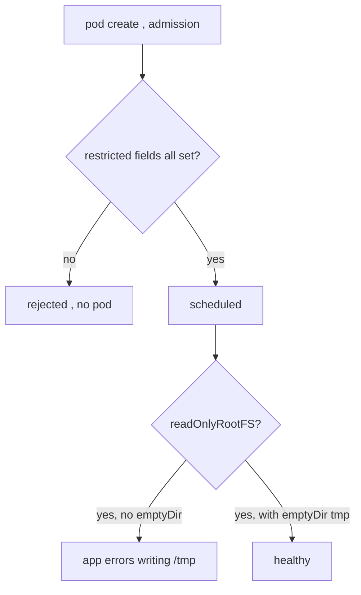

# securityContext + Pod Security Standards "restricted"

**Why:** the [restricted](deep:p4-image-hardening) Pod Security Standard is the bar serious clusters enforce (PSP is gone since 1.25). A pod that doesn't set the right fields is *rejected at admission* — so the chart must emit them by default, not as an afterthought.

**What restricted actually demands** (admission rejects on omission, not just bad values):

| Field | Required value | Where |
|---|---|---|
| `runAsNonRoot` | `true` | pod **and/or** container |
| `runAsUser` | non-zero (e.g. `10001`) | container/pod |
| `allowPrivilegeEscalation` | `false` | container |
| `capabilities.drop` | `["ALL"]` | container |
| `seccompProfile.type` | `RuntimeDefault` (or `Localhost`) | pod or container |
| `privileged` | `false`/unset | container |

`readOnlyRootFilesystem: true` is **not** required by restricted but is strongly recommended — and it drives a chart decision (see below).

```yaml
podSecurityContext:            # pod-level: applies to all containers + fsGroup for volumes
  runAsNonRoot: true
  runAsUser: 10001
  runAsGroup: 10001
  fsGroup: 10001               # group-owns mounted volumes so a non-root user can write
  seccompProfile: { type: RuntimeDefault }
securityContext:               # container-level: wins over pod-level on overlap
  allowPrivilegeEscalation: false
  readOnlyRootFilesystem: true
  capabilities: { drop: ["ALL"] }
```

**readOnlyRootFilesystem implications** — the #1 thing that breaks apps. Many processes write to `/tmp`, cache dirs, or PID files. With a read-only root you must mount writable `emptyDir`s for exactly those paths:

```yaml
volumeMounts:
  - { name: tmp, mountPath: /tmp }
volumes:
  - { name: tmp, emptyDir: {} }
```

nginx is the canonical victim — it writes `*_temp_path` and a PID file; that's why §4.2 uses **nginx-unprivileged** (paths pre-moved to `/tmp`, listens on 8080) plus `emptyDir` mounts.



**Pod vs container scope:** put `runAsNonRoot`, `fsGroup`, and `seccompProfile` at the **pod** level (shared); put `capabilities`, `allowPrivilegeEscalation`, `readOnlyRootFilesystem` at the **container** level. Container settings override pod settings where they overlap.

**Gotchas:** `runAsNonRoot: true` with an image whose `USER` is root (or numeric-unverifiable) → kubelet refuses to start it (`CreateContainerConfigError`) — pin a numeric `USER` in the Dockerfile ([image hardening](deep:p4-image-hardening)). `fsGroup` retroactively `chown`s large volumes on every mount — slow on big PVCs (use `fsGroupChangePolicy: OnRootMismatch`). Enforcement is per-**namespace** via the `pod-security.kubernetes.io/enforce: restricted` label, with `audit`/`warn` modes to roll out safely.

**Interview angle:** name the five fields restricted *rejects on omission* and explain why `readOnlyRootFilesystem` needs an `emptyDir` for `/tmp`.
