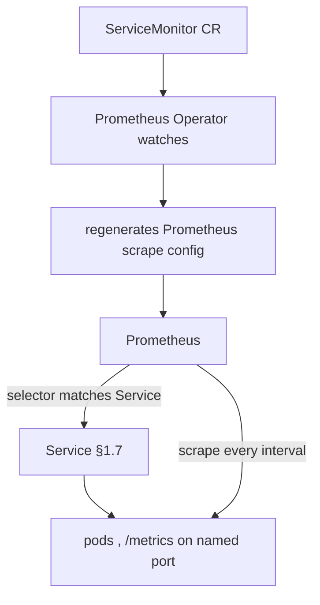

# ServiceMonitor (Prometheus Operator scrape config)

**Why:** you want metrics, but hardcoding scrape targets in Prometheus config doesn't scale and isn't GitOps-friendly. The **Prometheus Operator** turns scrape configuration into a CRD — a `ServiceMonitor` declares "scrape pods behind Services matching *these* labels on *this* path," and the operator regenerates Prometheus config automatically. The chart ships it gated.

**Gated template:**

```yaml
{{- if .Values.serviceMonitor.enabled }}
apiVersion: monitoring.coreos.com/v1
kind: ServiceMonitor
metadata:
  name: {{ include "app.fullname" . }}
  labels:
    release: {{ .Values.serviceMonitor.releaseLabel | default "kube-prometheus-stack" }}
spec:
  selector:
    matchLabels: {{- include "app.selectorLabels" . | nindent 6 }}
  endpoints:
    - port: {{ .Values.serviceMonitor.port | default "http" }}   # NAMED service port
      path: {{ .Values.serviceMonitor.path | default "/metrics" }}
      interval: {{ .Values.serviceMonitor.interval | default "30s" }}
{{- end }}
```



**Two label-matching gotchas that silently produce no metrics:**

1. **The `release` label must match the Prometheus instance's `serviceMonitorSelector`.** kube-prometheus-stack defaults to selecting ServiceMonitors labeled `release: <its-release-name>`. Wrong/missing label → the operator ignores your ServiceMonitor entirely, no error, no metrics. This is the most common "why isn't it scraping" cause.
2. **`spec.selector` matches the Service's labels, and the endpoint `port` is the Service port *name*** (not the pod's container port number). If the Service port is unnamed, the ServiceMonitor can't reference it.

**Why a Service (not a Pod) target:** a `ServiceMonitor` selects **Services**, then scrapes their backing pods' endpoints — so it rides on the same Service the chart already renders. (A `PodMonitor` exists for pods without a Service.)

**Gotchas:** the `monitoring.coreos.com/v1` CRD must exist (Prometheus Operator installed, wave-0 in §3.3) or the manifest fails to apply; `release` label mismatch = silent no-scrape (#1 cause); endpoint `port` is the Service port **name**, must be defined and named; the app must actually expose `/metrics` and the port must be in the Service; scrape `interval` too tight on a big fleet hammers Prometheus; if metrics need auth/TLS, add `bearerTokenSecret`/`tlsConfig` to the endpoint; under restricted PSS the metrics port is just another container port — no extra privilege needed.

**Interview angle:** "ServiceMonitor is applied, Service is up, app serves `/metrics`, but Prometheus shows no target — what's almost always wrong?" → the `release` label doesn't match Prometheus's `serviceMonitorSelector`, so the operator never picks it up.
