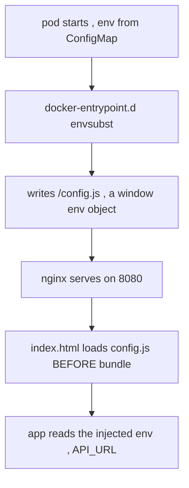

# SPA runtime config (the `import.meta.env` problem)

**Why:** Vite **inlines** `import.meta.env.VITE_*` into the JS bundle **at build time** (§3.4 Q9, [Vite runtime config](deep:p3-vite-runtime-config)). So setting an env var on the running pod does nothing — the value was frozen into the image weeks ago. One image can't then be promoted dev→staging→prod with different backend URLs. Three ways out.

**Option A — same-origin `/api` (the cleanest):** don't configure a backend URL at all. The SPA calls relative `/api/...`, the shared [Ingress](deep:p3-ingress-ownership) routes `/` to the frontend and `/api` to the backend (§1.8, §3.3 CS1). Nothing to bake, nothing to inject, no CORS. **Use this when** frontend and backend share a hostname (the common case).

**Option B — runtime `config.js` via entrypoint (`window.__ENV__`):** the image ships a placeholder `config.js`; a container entrypoint `envsubst`s real env vars into it before nginx starts. App reads `window.__ENV__` instead of `import.meta.env`.

```html
<!-- index.html -->
<script src="/config.js"></script>      <!-- loaded before the bundle -->
```

```js
// config.template.js  (baked into image, placeholders)
window.__ENV__ = {
  API_URL: "${API_URL}",
  FEATURE_X: "${FEATURE_X}"
};
```

```sh
# docker-entrypoint.d/40-runtime-config.sh  (nginx images run /docker-entrypoint.d/*.sh)
envsubst < /usr/share/nginx/html/config.template.js \
         > /usr/share/nginx/html/config.js
```

Now `API_URL` is a pod env var → a ConfigMap → a chart value. The **same image** runs in every environment; config becomes a [checksum-rolled](deep:p4-helm-checksum-rollout) ConfigMap.

**Option C — build-time baking (the default Vite behavior):** `VITE_API_URL` baked per build. **Avoid for multi-env** — you rebuild per environment, which breaks "promote the exact artifact you tested."



| Option | Same image all envs? | CORS? | Extra moving parts |
|---|---|---|---|
| A same-origin `/api` | yes | none | ingress routing only |
| B runtime config.js | yes | maybe | entrypoint + config.js + ConfigMap |
| C build-time bake | **no** (rebuild/env) | maybe | none, but breaks promotion |

**Gotchas:** `config.js` must load **before** the app bundle (put it in `<head>`, not bundled) or the app reads `undefined`; never put **secrets** in `config.js` — it's served to every browser (frontend config is public by definition); `config.js` itself must be `no-store` cached or env changes won't propagate ([nginx config](deep:p4-nginx-spa-config)); with a read-only root FS the entrypoint can't write into `/usr/share/nginx/html` — mount that dir (or just `config.js`) as a writable `emptyDir`; Option A still needs the Ingress path split right or `/api` 404s (§3.4 Q7).

**Interview angle:** "Setting `VITE_API_URL` on the running frontend pod does nothing — why, and what's the simplest fix?" → Vite inlines at build time; same-origin `/api` (Option A) needs no injected config at all.
