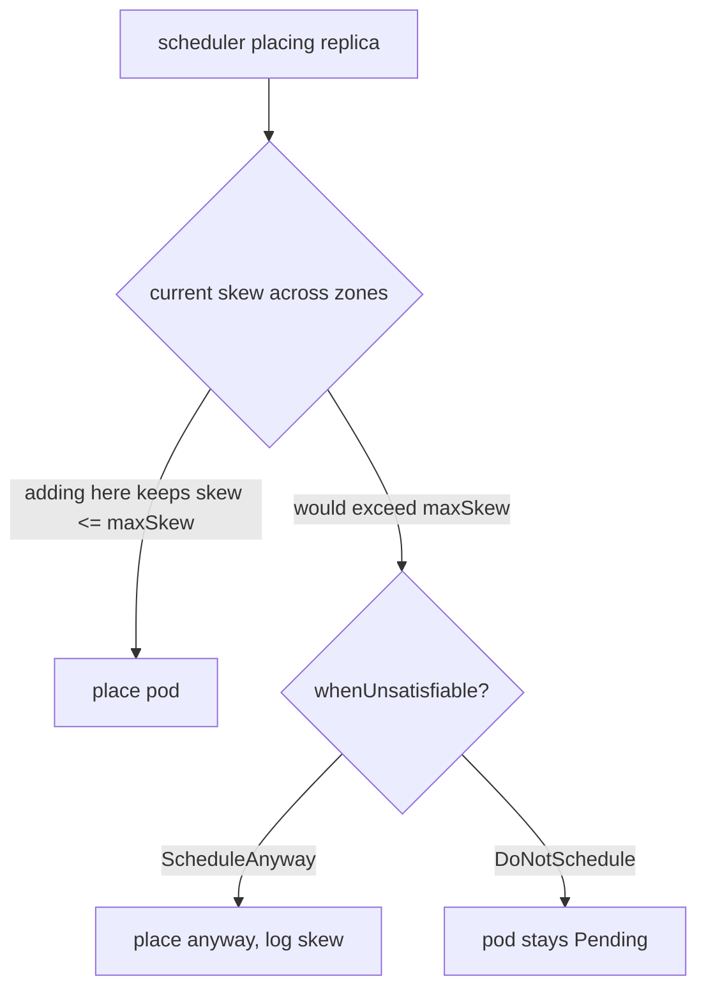

# topologySpreadConstraints vs podAntiAffinity

**Why:** three replicas all landing on one node (or one AZ) means one failure takes the whole service down — defeating the point of replicas. Spreading is how you turn N replicas into N *independent* failure domains. Pairs with [PDB](deep:p4-pdb-config): spread prevents correlated failure, PDB prevents correlated *voluntary* disruption.

**Two tools, same goal, different ergonomics:**

| | topologySpreadConstraints | podAntiAffinity |
|---|---|---|
| Model | "keep skew ≤ N across this topology key" | "don't co-locate with pods matching X" |
| Granularity | tunable skew, soft or hard | required (hard) or preferred (soft) |
| Scale | designed for many pods, even spread | gets expensive / blunt at scale |
| Verbose? | concise | verbose, O(pods²) scheduling cost |
| Recommended (2026) | **yes, the default** | legacy / special cases |

**Chart default — spread across zones and nodes:**

```yaml
topologySpreadConstraints:
  - maxSkew: 1
    topologyKey: topology.kubernetes.io/zone
    whenUnsatisfiable: ScheduleAnyway        # SOFT: prefer spread, don't block scheduling
    labelSelector:
      matchLabels: { app.kubernetes.io/name: myapp }
  - maxSkew: 1
    topologyKey: kubernetes.io/hostname
    whenUnsatisfiable: ScheduleAnyway
    labelSelector:
      matchLabels: { app.kubernetes.io/name: myapp }
```

`maxSkew: 1` = the count difference between the most- and least-populated domain may not exceed 1. `ScheduleAnyway` (soft) is the safe default; `DoNotSchedule` (hard) can leave pods **Pending** if a zone is full — only use hard when correctness demands it.



**Why soft by default:** a hard zone constraint plus an autoscaler scaling a single replica into a zone that's at capacity = a stuck Pending pod and a paged engineer. Soft spread gets you balanced placement 99% of the time and degrades gracefully. Flip to `DoNotSchedule` only for quorum systems where co-location violates correctness.

**Gotchas:** `labelSelector` must match the pod's *own* labels or the constraint silently does nothing; combining with `nodeSelector`/taints narrows the domain set and can make a "soft" spread effectively impossible; skew is computed over *existing* matching pods, so the **first** few replicas in a scale-up may cluster before balancing; node labels `topology.kubernetes.io/zone` and `kubernetes.io/hostname` must actually exist (managed clusters set them, bare-metal may not); a hard constraint interacts badly with [PDB](deep:p4-pdb-config) during node drains — pods can't reschedule.

**Interview angle:** "Why prefer topologySpread over podAntiAffinity, and when would `DoNotSchedule` page you at 3am?" → spread scales and expresses skew tolerance; hard mode + full zone = Pending.
