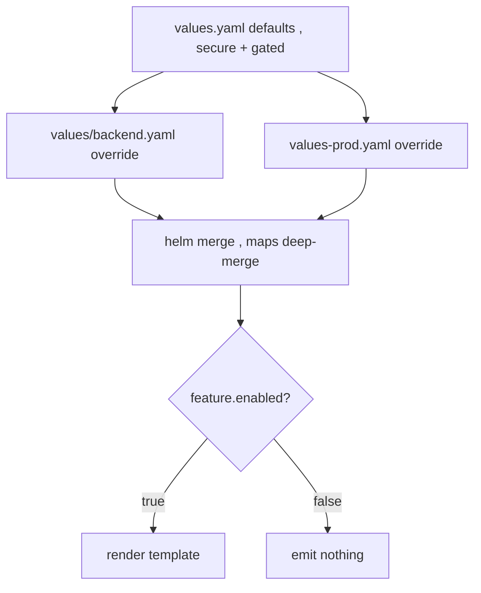

# values.yaml design for a generic chart

**Why:** the [generic chart](deep:p3-generic-chart) lives or dies by its `values.yaml`. Every feature must be **gated** (off by default) and **parameterized**, or one consumer's edge case forces a template change that breaks the other five services.

**The design rules:**

1. **Every optional feature behind a boolean + `if`.** `ingress.enabled`, `autoscaling.enabled`, `pdb.enabled`, `serviceMonitor.enabled`, `networkPolicy.enabled` — all default `false`.
2. **`{{- with .Values.x }}`** for optional *blocks* so an unset value emits **nothing** rather than `null` or `{}`.
3. **Secure-by-default**, not permissive-by-default: restricted [securityContext](deep:p4-securitycontext), resource requests present, `replicaCount: 2`.
4. **Never hardcode names** — use [helpers](deep:p3-helpers-tpl).
5. **Pass-through escape hatches**: `extraEnv`, `extraVolumes`, `podAnnotations`, `extraLabels` so a special case doesn't need a template edit.

**The `with` + `toYaml | nindent` pattern (the workhorse):**

```yaml
{{- with .Values.nodeSelector }}
nodeSelector: {{- toYaml . | nindent 8 }}
{{- end }}
```

If `nodeSelector` is unset, the whole block vanishes — no empty `nodeSelector: {}` in the rendered manifest. This is what keeps a generic chart's output clean across wildly different services.



**Booleans need a careful default idiom.** `{{ .Values.x | default true }}` is a trap: it can't distinguish "unset" from "explicitly false" (both are falsy in Go templates), so an override of `false` gets flipped back to `true`. For booleans that default true, test with `(ne .Values.x false)` or document that the key must be set. Numbers have the inverse `--set` trap: `--set image.tag=1.40` becomes the float `1.4`; use `--set-string` ([values precedence](deep:p3-values-precedence)).

**Lists don't merge.** `env`, `volumes`, `args` are **replaced wholesale** across values files (§3.1). So provide structured knobs (`env: {KEY: val}` rendered into a list) plus an `extraEnv: []` raw passthrough, rather than expecting users to append to a list across files.

**Gotchas:** an ungated field with no default breaks **every** consumer the moment one needs it absent; `default` on booleans inverts explicit `false`; deeply nested values are unreadable — keep ≤3 levels; `required "msg" .Values.image.repository` is better than a silent empty-string image; document every knob inline (the chart's `values.yaml` *is* the API docs — `helm show values` is authoritative per §3.1).

**Interview angle:** "Why is `{{ .Values.enabled | default true }}` a bug for a boolean?" → unset and explicit-false are indistinguishable, so `false` overrides get silently re-enabled.
