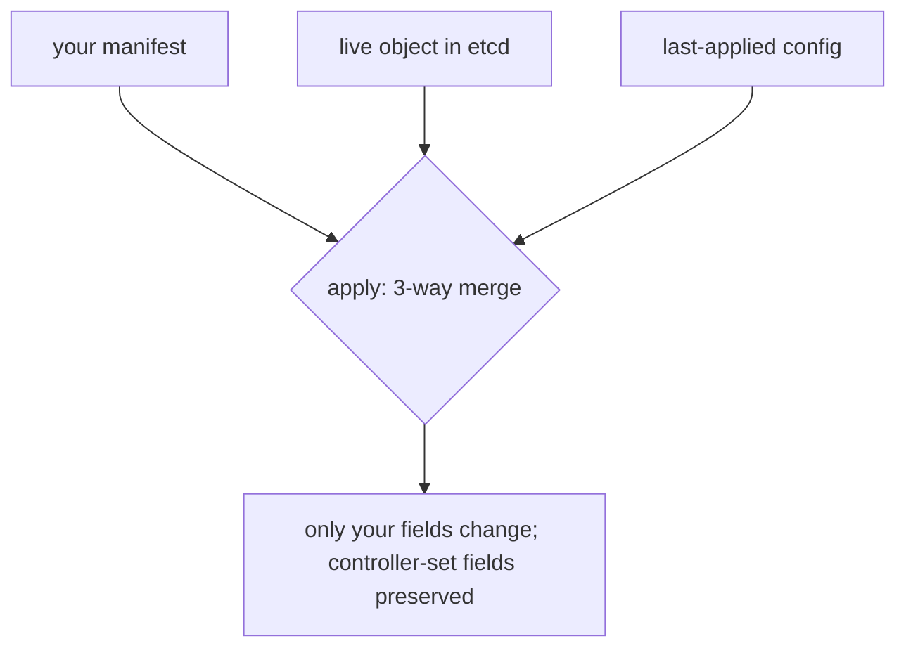

# apply vs create vs replace

Three verbs that all "put an object in the cluster" — but they differ in **who owns which fields** and what happens when the object already exists.

| Verb | If object absent | If object exists | Mental model |
|---|---|---|---|
| `kubectl create -f` | creates it | **errors** (`AlreadyExists`) | imperative one-shot |
| `kubectl apply -f` | creates it | **merges** your fields, leaving others alone | declarative, idempotent |
| `kubectl replace -f` | **errors** (not found) | **overwrites** the whole object | full replace |

## Why apply is the default

`apply` is **declarative and idempotent**: run it ten times, converge to the same state, no errors. It performs a **3-way merge** between (1) your manifest, (2) the live object, and (3) the *last-applied* configuration — so it can tell "the user removed this field" from "some controller added it."

- **Client-side apply** records the last-applied config in the `kubectl.kubernetes.io/last-applied-configuration` annotation.
- **Server-side apply** (`--server-side`) moves the merge to the apiserver and tracks **field ownership** via `managedFields`. Two actors (you + an HPA + a controller) can each own different fields without clobbering each other — the modern, conflict-aware path. Conflicts surface as errors you resolve with `--force-conflicts`.

## When to use which

- **`apply`** — virtually always; GitOps, CI, hand edits. The one verb to internalize.
- **`create`** — scaffolding/generators (`create deploy … --dry-run=client -o yaml`), or when you *want* it to fail on a pre-existing object.
- **`replace`** — rare; forcibly reset an object to exactly the manifest (drops fields not present). `replace --force` deletes and recreates — destroys the object's identity (new UID, restarts Pods).

## Gotchas

- **`apply` won't delete fields you removed if they were never apply-managed.** A field added by `create`/`edit` then dropped from your manifest may linger. Use `--prune` (or server-side apply) carefully, scoped by label.
- **`replace` discards controller-set fields** (e.g. a Service's `clusterIP`, an HPA's adjustments) — it overwrites the whole spec. Mixing `apply` and `replace`/`edit` on the same object fights over ownership.
- **Apply + HPA conflict:** if your Deployment manifest sets `replicas` *and* an HPA controls it, every `apply` resets the count and fights the HPA. Omit `replicas` from the manifest, or use server-side apply so the HPA owns that field.

## Interview angle
"`apply` vs `create`?" → create is imperative and errors on existing objects; apply is declarative, idempotent, does a 3-way merge. "Two controllers keep overwriting each other's fields on the same object?" → server-side apply with `managedFields` ownership.
