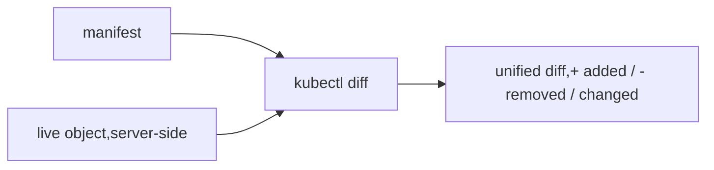

# --dry-run & kubectl diff

Two ways to know what an `apply` *would* do before it does it — essential for safe changes and for scaffolding manifests.

## --dry-run

```bash
kubectl apply -f x.yaml --dry-run=client     # validate + render LOCALLY, send nothing
kubectl apply -f x.yaml --dry-run=server     # run server admission/validation, persist nothing
kubectl create deploy demo --image=nginx --dry-run=client -o yaml   # scaffold a manifest
```

| Mode | Where it runs | Catches | Sends to apiserver? |
|---|---|---|---|
| `client` | your machine | basic schema/syntax | no |
| `server` | apiserver | admission webhooks, defaulting, quota, conflicts, CRD validation | yes (but doesn't store) |

- **`client`** is the scaffolding workhorse: pair with `-o yaml` to generate a starting manifest you then edit (Deployment, Service, ConfigMap from `--from-literal`, etc.). It does *not* contact the cluster, so it won't catch admission/quota issues.
- **`server`** is the realistic preview: it runs the full request through validating/mutating webhooks and defaulting, returning the object the server *would* persist — without persisting it. Use it to catch policy rejections (OPA/Kyverno) before they bite in CI.

## kubectl diff

```bash
kubectl diff -f x.yaml          # unified diff: manifest vs LIVE cluster state
kubectl diff -f .               # whole directory
```



`diff` does a **server-side dry-run apply** and diffs the result against the live object — so it shows exactly the fields `apply` would change, *including* server-defaulted and webhook-mutated values. It's the truest "what will this PR do to prod?" preview.

## Gotchas

- **`diff` reports noise** from fields a controller manages (e.g. `replicas` under an HPA, status fields) — those "changes" get reconciled right back. Don't panic at every `-`/`+`.
- `kubectl diff` **exits non-zero (1) when a diff exists** — handy in CI (`if kubectl diff -f . ; then …`), but it trips naive scripts that treat non-zero as failure.
- `client` dry-run misses everything server-side: a manifest that passes `--dry-run=client` can still be rejected by an admission webhook. Use `server` for real validation.
- `diff` needs read+dry-run RBAC on the target objects; locked-down namespaces may refuse it.

## Interview angle
"Preview a change against prod without applying?" → `kubectl diff -f .` (server-side dry-run vs live). "Generate a manifest skeleton from a command?" → `kubectl create … --dry-run=client -o yaml`. "client vs server dry-run?" → client = local schema only; server = full admission/defaulting, nothing persisted.
