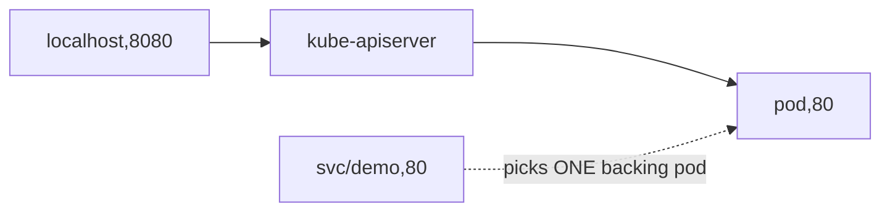

# kubectl exec & port-forward

Two ways to reach *into* a running workload from your laptop: `exec` runs a command inside a container; `port-forward` tunnels a local TCP port to a Pod/Service port. Both stream over the apiserver — no inbound firewall changes needed.

## exec

```bash
kubectl exec -it <pod> -- <cmd>            # one container
kubectl exec -it <pod> -c <ctr> -- sh      # pick a container; -- separates flags from the command
kubectl exec <pod> -- env                  # non-interactive, capture output
```

- `--` ends kubectl's own flags; everything after is the command **run inside the container**. Forget it and kubectl tries to parse your command's flags.
- `-it` = `-i` (keep stdin open) + `-t` (allocate a TTY) — the combo for an interactive shell. Drop `-t` when piping output to a file (a TTY mangles it).
- `-c` is required for multi-container Pods. The command must exist *in that image* — distroless images have no `sh`; use [`kubectl debug`](deep:p5-logs-debug) instead.

## port-forward

```bash
kubectl port-forward <pod> 8080:80                 # localhost:8080 -> pod:80
kubectl port-forward svc/demo 8080:80              # forward to a SERVICE port
kubectl port-forward deploy/demo 5432              # same local & remote port
kubectl port-forward svc/demo 8080:80 --address 0.0.0.0   # expose to your LAN (careful)
```



- `svc/<name>` resolves the Service's selector and forwards to **one** backing Pod — it is **not** load-balanced (the forward pins to a single Pod for its lifetime).
- `<local>:<remote>`; omit the colon to use the same number both sides. Forwarding to a privileged local port (<1024) needs root.
- It's a debugging/admin tunnel — when the command exits, the tunnel closes. Not for production traffic (no LB, single connection, dies with your terminal).

## Gotchas

- **`exec` runs in an existing container** — it shares that container's filesystem and env, but changes are lost on restart and don't persist to the image.
- **port-forward to a Service is sticky to one Pod**, so it's useless for testing load balancing — hit the Service VIP from inside the cluster (a debug Pod) for that.
- A dropped connection (laptop sleep, network blip) silently kills the forward; re-run it.
- `exec`/`port-forward` require the `pods/exec` and `pods/portforward` RBAC verbs — locked down in hardened clusters.

## Interview angle
"Test a ClusterIP Service from your laptop?" → `kubectl port-forward svc/x 8080:80` (but it pins one Pod, no LB). "`exec` fails with 'executable not found'?" → distroless image, no shell — use `kubectl debug` with an ephemeral container.
