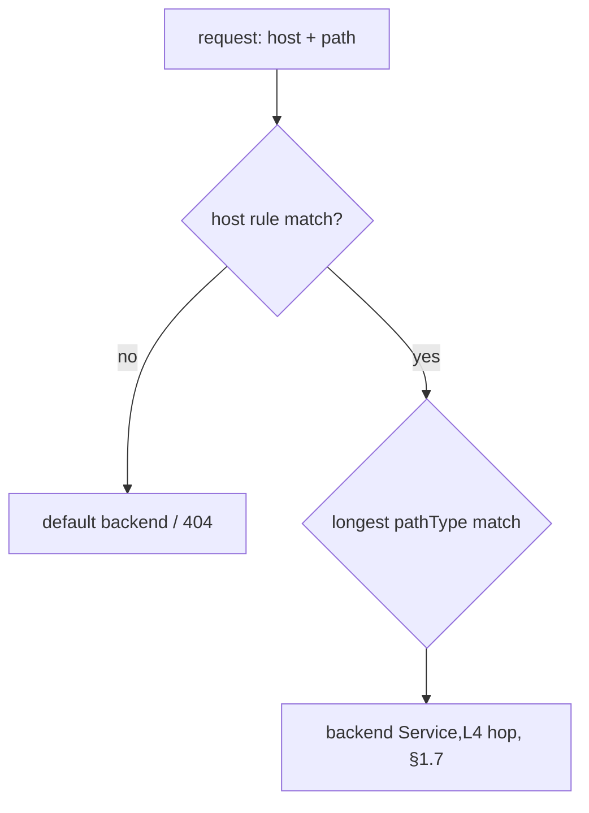

# Ingress manifest: pathType & rules

An Ingress (§1.8) is **rules data**; a controller executes them. The manifest's job is to express host/path → Service mappings precisely — and `pathType` is the field people forget is **required**.

```yaml
apiVersion: networking.k8s.io/v1
kind: Ingress
metadata:
  name: demo-ing
spec:
  ingressClassName: nginx
  tls:
    - hosts: [demo.example.com]
      secretName: demo-tls         # a kubernetes.io/tls Secret
  rules:
    - host: demo.example.com
      http:
        paths:
          - path: /api
            pathType: Prefix
            backend:
              service: { name: api, port: { number: 80 } }
          - path: /
            pathType: Prefix
            backend:
              service: { name: demo, port: { number: 80 } }
```

## pathType — the three values

| `pathType` | Matches | `/foo` matches… |
|---|---|---|
| `Prefix` | path element prefixes (split on `/`) | `/foo`, `/foo/`, `/foo/bar` — **not** `/foobar` |
| `Exact` | the exact path, case-sensitive | only `/foo` |
| `ImplementationSpecific` | up to the controller (often regex/annotations) | controller-defined |

- `Prefix` matches on **path segments**, not string prefix — `/foo` does **not** match `/foobar`. This surprises people expecting substring behavior.
- **`pathType` is mandatory** in `networking.k8s.io/v1`; omitting it is a validation error (the old beta API let you skip it).

## ingressClassName & rule resolution



- **`ingressClassName`** picks which installed controller owns this Ingress (replaces the legacy `kubernetes.io/ingress.class` annotation). With multiple controllers, the wrong/blank class = ignored.
- Among matching paths, controllers generally pick the **most specific** (longest) match. Order `/api` before `/` mentally, though the controller sorts by specificity.
- **`tls`** terminates HTTPS using a `kubernetes.io/tls` Secret; the host must match the rule host.

## Gotchas

- **No controller installed → the Ingress does nothing** (§1.8). The object validates and persists but routes nothing.
- **`Prefix` ≠ string prefix** — segment-based; `/foo` won't catch `/foobar`.
- **Annotations are vendor-specific** (nginx rewrites, timeouts, auth) — they don't port to Traefik/others. [Gateway API](deep:p1-gateway-api) exists to kill that lock-in.
- **One host owned by two Ingress objects** → conflicting rules / undefined precedence; keep a host single-owner (§3.2, [ingress ownership](deep:p3-ingress-ownership)).

## Interview angle
"Why doesn't `/foo` match `/foobar` with `pathType: Prefix`?" → Prefix matches path *segments*, not substrings. "Ingress applied but nothing routes?" → no controller, or `ingressClassName` doesn't match an installed one.
