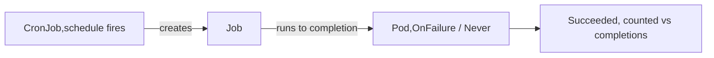

# Job vs CronJob

Deployments/ReplicaSets keep Pods running forever; **Jobs run a Pod to completion** and stop. A **CronJob** creates Jobs on a schedule. Both are `batch/v1`.

## Job

```yaml
apiVersion: batch/v1
kind: Job
metadata: { name: demo-job }
spec:
  completions: 5        # run to 5 successful Pods
  parallelism: 2        # at most 2 at once
  backoffLimit: 4       # retries before marking the Job Failed
  activeDeadlineSeconds: 600
  template:
    spec:
      restartPolicy: OnFailure   # Jobs: OnFailure or Never (never Always)
      containers:
        - name: task
          image: busybox:1.36
          command: ["sh", "-c", "echo work; sleep 5"]
```

- `completions` — how many **successful** Pod runs = done (default 1).
- `parallelism` — concurrent Pods (work-queue style if you leave `completions` unset and exit when the queue drains).
- `backoffLimit` — failed-Pod retries before the Job gives up; backs off exponentially.
- `restartPolicy` **must be `OnFailure` or `Never`** — `Always` is illegal (the Job would never finish).
- `activeDeadlineSeconds` — hard wall-clock cap regardless of retries.

## CronJob

```yaml
apiVersion: batch/v1
kind: CronJob
metadata: { name: demo-cron }
spec:
  schedule: "*/5 * * * *"          # min hour day-of-month month day-of-week
  timeZone: "UTC"
  concurrencyPolicy: Forbid        # Allow | Forbid | Replace
  startingDeadlineSeconds: 120
  successfulJobsHistoryLimit: 3
  failedJobsHistoryLimit: 1
  jobTemplate:
    spec:
      backoffLimit: 2
      template:
        spec:
          restartPolicy: OnFailure
          containers: [{ name: task, image: busybox:1.36, command: ["date"] }]
```



- **`schedule`** — standard 5-field cron. `timeZone` makes it explicit (default is the controller's zone).
- **`concurrencyPolicy`** — `Allow` (overlap), `Forbid` (skip if previous still running), `Replace` (kill old, start new).
- **`startingDeadlineSeconds`** — if the controller misses a scheduled time by more than this (e.g. it was down), skip that run instead of firing late.
- **History limits** cap how many finished Jobs/Pods are retained for inspection.

## Gotchas

- **`restartPolicy: Always` on a Job is rejected** — it would loop forever.
- **A missed schedule isn't always recovered** — if the controller was down past `startingDeadlineSeconds`, the run is skipped (no automatic backfill).
- **`Forbid` doesn't queue** — overlapping triggers are dropped, not delayed; a long-running Job can silently skip ticks.
- Completed Job Pods **linger** (for logs) until history limits or TTL (`ttlSecondsAfterFinished`) clean them — they can pile up.

## Interview angle
"Job vs CronJob?" → Job runs Pods to completion once; CronJob templates Jobs on a cron schedule. "Why can't a Job use `restartPolicy: Always`?" → it would never reach completion. "Two CronJob runs overlapped?" → set `concurrencyPolicy: Forbid` or `Replace`.
