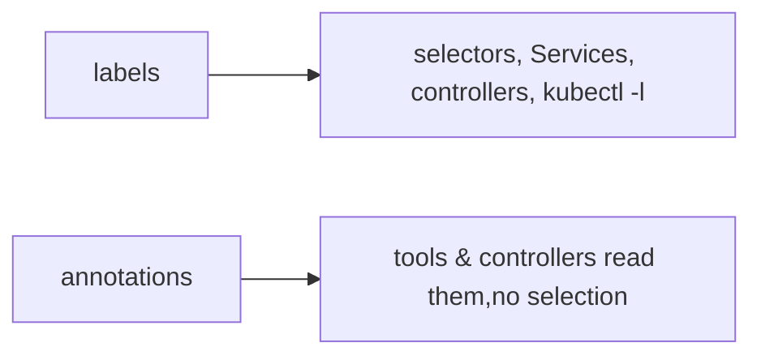

# Managing labels & annotations from kubectl

Labels and annotations are both key/value metadata, but they serve opposite purposes: **labels are for selecting**, **annotations are for everything else**.

| | Labels | Annotations |
|---|---|---|
| Purpose | identify & **select** (§1.4) | attach non-identifying data |
| Selectable? | yes (`-l`, selectors) | **no** |
| Size/charset | constrained (≤63 char values, limited charset) | large, arbitrary (URLs, JSON, configs) |
| Examples | `app=demo`, `tier=web` | `kubernetes.io/change-cause`, checksum hashes, tool config |

## CLI

```bash
kubectl label <kind> <name> tier=web              # add a label
kubectl label <kind> <name> tier=cache --overwrite  # change an existing one (else it errors)
kubectl label <kind> <name> tier-                 # remove (trailing dash)
kubectl label pods -l app=demo canary=true        # bulk: label everything matching a selector

kubectl annotate <kind> <name> note="see PR-42"   # add/overwrite annotation
kubectl annotate <kind> <name> note-              # remove
```

- **`--overwrite` is required to change an existing label** — without it, kubectl refuses, protecting you from clobbering a selector key.
- **Trailing `-`** (`key-`) removes the key. Same syntax for both verbs.
- **`-l` on `label`/`annotate`** applies in bulk to everything matching the selector — powerful and dangerous.



## Why the distinction bites

- **Changing a label that a Service/controller selects on re-routes traffic or re-parents Pods.** A live Deployment's `selector` is immutable, but stamping/removing a Pod label can pull it in/out of a Service's endpoints instantly (§1.7, §1.9).
- **Annotations drive controller behavior** without affecting selection: the [checksum annotation](deep:p2-checksum-annotation) forces a rollout on config change, `kubernetes.io/change-cause` fills `rollout history`, and ingress controllers read vendor annotations ([ingress manifest](deep:p5-ingress-manifest)).

## Gotchas

- **Editing labels imperatively drifts from your manifests** — the next [`apply`](deep:p5-apply-vs-create) may not remove a label you added by hand (apply only manages fields it knows about). Keep label changes in Git.
- **Label value constraints** (≤63 chars, `[a-z0-9A-Z]` with `-_.`) — put long/arbitrary data in **annotations**, not labels.
- **Bulk `kubectl label -l … --overwrite`** can silently re-route many Services at once; double-check the selector first with a `get`.

## Interview angle
"Labels vs annotations?" → labels are selectable identity used by Services/controllers; annotations are non-selectable metadata for tools. "Why won't `kubectl label` change my existing label?" → needs `--overwrite` to avoid clobbering selector keys. "How to remove a label?" → `kubectl label … key-` (trailing dash).
