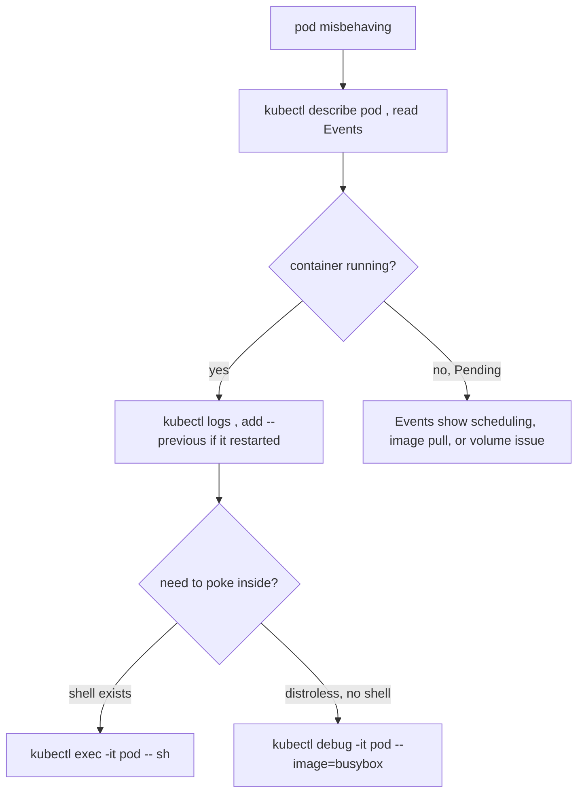

# kubectl logs & debugging a Pod

`kubectl logs` reads a container's stdout/stderr as captured by the container runtime (CRI) on the node — it is **not** reading a file you control, so anything your app writes to a logfile inside the container is invisible here.

## The flags that matter

```bash
kubectl logs <pod>                       # current container, all buffered lines
kubectl logs <pod> -c <ctr>              # a SPECIFIC container in a multi-container pod
kubectl logs <pod> -f                    # follow (stream) — Ctrl-C to stop
kubectl logs <pod> --tail=100            # last 100 lines only
kubectl logs <pod> --since=15m           # last 15 minutes
kubectl logs <pod> --previous            # the PREVIOUS (crashed) instance's logs
kubectl logs -l app=demo --all-containers --prefix   # fan out across a Deployment's pods
```

- **`--previous` (`-p`) is the crash-loop tool.** When a container restarts, the live logs only show the *new* instance — which may have just started cleanly. The reason it died is in the *previous* instance. `CrashLoopBackOff`? `kubectl logs <pod> --previous` first.
- **`-c` is mandatory** when a Pod has multiple containers (sidecars/init); otherwise you get an error listing the choices. For init containers use the init container's name.
- `--tail` defaults to *all* lines for a single pod but to a small recent window when using `-l`/`--all-containers`.

## The debugging ladder



`kubectl describe` first — its **Events** section explains `Pending` (no node fits, image pull fail, unbound PVC) and `CrashLoopBackOff` causes that logs alone won't. Then `logs` for application output. Then `exec`/`debug` to inspect from inside.

## `kubectl debug` for distroless

Modern images often ship no shell, so `exec -- sh` fails. `kubectl debug -it <pod> --image=busybox --target=<ctr>` attaches an **ephemeral container** that shares the target's process and network namespace — you get a shell *next to* the broken container without rebuilding the image.

## Gotchas

- Logs are gone once the Pod object is deleted — ship them to a log backend for anything you need post-mortem.
- `--previous` only works while the prior instance's logs are still on the node; after enough restarts/rotation they're evicted.
- A `Running` pod with no logs and failing readiness usually means the process started but isn't serving — check the [readiness probe](deep:p2-probes), not the logs.

## Interview angle
"Pod is CrashLoopBackOff — how do you find why?" → `describe` for Events, then `logs --previous` (the *dead* instance, not the restarting one). "Can't `exec` into a distroless container?" → `kubectl debug` with an ephemeral container sharing the namespace.
