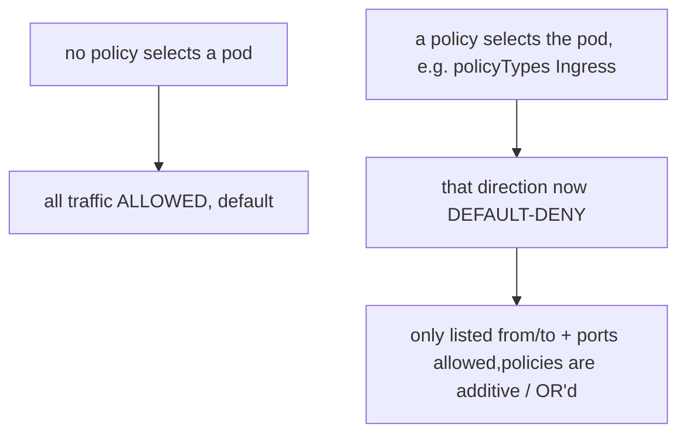

# NetworkPolicy manifest

By default the flat pod network allows **everything** to talk to everything (§1.1). A NetworkPolicy (`networking.k8s.io/v1`) is an **allow-list firewall** at L3/L4 between Pods. The model is subtle: policies are additive, and *selecting* a Pod flips it to default-deny for the chosen direction.

```yaml
apiVersion: networking.k8s.io/v1
kind: NetworkPolicy
metadata: { name: demo-policy }
spec:
  podSelector:
    matchLabels: { app: demo }     # which pods this APPLIES to ({} = all in ns)
  policyTypes: [Ingress, Egress]
  ingress:
    - from:
        - podSelector: { matchLabels: { app: frontend } }   # same-namespace pods
        - namespaceSelector: { matchLabels: { team: web } } # whole namespaces
        - ipBlock: { cidr: 10.0.0.0/16, except: [10.0.5.0/24] }
      ports:
        - { protocol: TCP, port: 80 }
  egress:
    - to:
        - namespaceSelector: {}          # any namespace…
          podSelector: { matchLabels: { k8s-app: kube-dns } }  # …but only CoreDNS pods
      ports:
        - { protocol: UDP, port: 53 }
        - { protocol: TCP, port: 53 }
```

## The mental model



- **`podSelector`** = which Pods the policy governs. `{}` selects every Pod in the namespace.
- **`policyTypes`** = which directions this policy controls. Listing `Ingress` with an empty `ingress: []` = **deny all ingress**. A common pattern is a `{}`-selector default-deny, then layer allow-policies.
- **`from`/`to` peers** — `podSelector` (same ns), `namespaceSelector` (whole ns), both together (pods *in* matching ns), or `ipBlock` (CIDR, with `except`).
- **Policies are additive (OR'd)** — union of all matching policies' allows; there is no explicit deny rule, only "not allowed."

## Gotchas

- **Needs an enforcing CNI.** Calico/Cilium enforce; plain Flannel does **not** — the policy applies cleanly and silently does nothing ([NetworkPolicy](deep:p1-network-policy)).
- **Selecting a Pod for `Egress` and forgetting DNS breaks it** — once egress is default-deny you must explicitly allow UDP/TCP 53 to CoreDNS, or every name lookup fails (§1.9 trap).
- **`podSelector + namespaceSelector` in the same `from` element is AND** (pods matching *both*); listing them as **separate** list items is OR. Easy to invert accidentally.
- **Empty `namespaceSelector: {}` = all namespaces**, not "this namespace." To scope to current ns, use a `podSelector` alone.
- Policies are **namespaced** — a policy only governs Pods in its own namespace.

## Interview angle
"Default K8s network posture?" → wide open; NetworkPolicy is opt-in allow-listing, and only enforced by a capable CNI. "Added an egress policy and DNS broke?" → egress went default-deny; you must allow port 53 to kube-dns. "podSelector vs namespaceSelector together?" → in one peer = AND; separate peers = OR.
