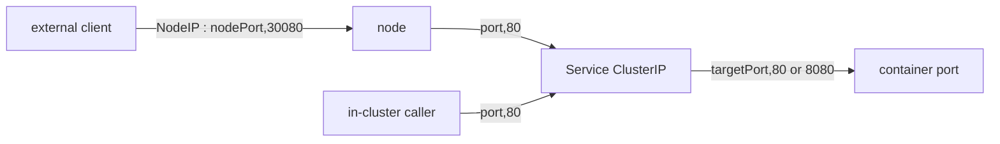

# Service: port vs targetPort vs nodePort

Three port fields on a Service do three different jobs. Mixing them up is the most common reason "the Service exists but nothing connects."



| Field | On which side | Meaning |
|---|---|---|
| `port` | the Service | the port the **Service VIP** listens on — what in-cluster callers hit |
| `targetPort` | the Pod | the **container** port traffic is forwarded to (number, or a named containerPort) |
| `nodePort` | every node | (NodePort/LoadBalancer only) the port opened on **every node's IP**, 30000–32767 |

```yaml
ports:
  - name: http
    port: 80          # callers: demo:80
    targetPort: 8080  # container actually listens on 8080
    nodePort: 30080   # NodePort only; reachable at NodeIP:30080
```

## The rules

- **`targetPort` defaults to `port`** if omitted — fine only when the container listens on the same number. If your app listens on 8080 but `port: 80` and you omit `targetPort`, traffic goes to container port 80 → connection refused.
- **`targetPort` can be a name**: reference a `containerPort`'s `name` (e.g. `targetPort: http`) so you can change the container's number without touching the Service.
- **`nodePort`** is auto-assigned from 30000–32767 unless you pin it; pinning risks collisions and limits portability.
- **`port` is arbitrary** — it's the Service's own contract; callers use the DNS name + this port, never the container port directly.

## Gotchas

- **Wrong `targetPort` = endpoints exist but connections refuse.** The Service has Ready endpoints (selector matched), but the port maps to something the container isn't listening on. Classic §1.9 trap, distinct from the *selector-mismatch* trap (which yields *zero* endpoints).
- **Named ports must exist** on the Pod's `containerPort.name`, or resolution fails.
- A multi-port Service **must name each port** (`name:`), or the API rejects it.
- `nodePort` outside 30000–32767 needs the apiserver's `--service-node-port-range` widened — don't assume.

## Interview angle
"port vs targetPort vs nodePort?" → port = Service VIP port (in-cluster), targetPort = container port it forwards to, nodePort = port on every node for external reach. "Service has endpoints but connections refuse?" → `targetPort` points at a port the container isn't listening on (vs *no* endpoints = selector mismatch).
