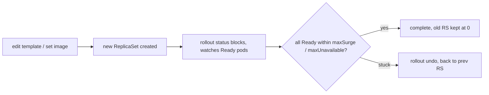

# kubectl rollout — status, undo, restart

A Deployment update (new image, changed env, edited template) spawns a **new ReplicaSet** and migrates Pods one batch at a time (§1.6). `kubectl rollout` is how you watch, reverse, and force that process.

## The subcommands

```bash
kubectl rollout status   deploy/demo            # block until rollout finishes (or fails)
kubectl rollout history  deploy/demo            # list revisions
kubectl rollout history  deploy/demo --revision=3   # show one revision's template
kubectl rollout undo     deploy/demo            # roll back to the PREVIOUS revision
kubectl rollout undo     deploy/demo --to-revision=2
kubectl rollout restart  deploy/demo            # rolling re-create of all pods, same spec
kubectl rollout pause    deploy/demo            # freeze mid-rollout (e.g. canary checkpoint)
kubectl rollout resume   deploy/demo
```



## How each works

- **`status`** watches until the new RS has enough Ready replicas (or the `progressDeadlineSeconds` timeout fires → non-zero exit). Use it in CI to fail a deploy that never goes healthy.
- **`undo`** doesn't delete anything — it scales the *previous* ReplicaSet back up and the current one down. Old RSs are retained per `revisionHistoryLimit` (default 10); that's the rollback inventory.
- **`restart`** patches a template annotation (`kubectl.kubernetes.io/restartedAt`), changing the Pod template hash → a new RS → a clean rolling re-create. The go-to for "pick up a rotated Secret/ConfigMap" or "clear a wedged state" without changing the spec.
- **`pause`/`resume`** let you stop after the first new Pod (manual canary) and batch several edits into one rollout.

## Gotchas

- **Only template changes roll.** Editing `replicas` scales but does **not** create a new revision — `rollout undo` won't reverse a scale.
- **No readiness probe → instant "success."** `rollout status` returns immediately because the new Pods are considered available the moment they're Running, even if they can't serve (§1.6).
- **`--record` is deprecated**; the `CHANGE-CAUSE` column comes from the `kubernetes.io/change-cause` annotation if you set it.
- `rollout restart` is the correct way to reload mounted Secrets/ConfigMaps that the app reads only at boot — see the [checksum annotation](deep:p2-checksum-annotation) for the GitOps-friendly variant.

## Interview angle
"How do you roll back a bad deploy?" → `kubectl rollout undo deploy/x` (scales the prior RS up; no data lost). "App caches a Secret at startup and you rotated it — how to reload without editing the spec?" → `kubectl rollout restart`.
