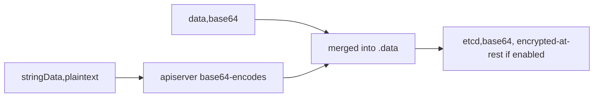

# Secret: data vs stringData (and base64 ≠ encryption)

A Secret (§2.2) holds two fields for values — `data` and `stringData` — and the difference trips everyone once.

## The two fields

```yaml
apiVersion: v1
kind: Secret
metadata: { name: demo-secret }
type: Opaque
stringData:
  DB_PASSWORD: "s3cr3t-pw"     # plaintext you write; kubectl encodes it
data:
  API_TOKEN: YWJjMTIz          # you supply base64 ("abc123")
```

| Field | You write | Direction | Stored as |
|---|---|---|---|
| `stringData` | plaintext | **write-only** (never read back) | base64 in etcd |
| `data` | base64 | read + write | base64 in etcd |

- **`stringData` is a convenience for authoring.** On apply, the apiserver base64-encodes it and **merges it into `data`** — then `stringData` disappears from the stored object. `kubectl get -o yaml` shows only `data`.
- If a key exists in *both*, `stringData` **wins**.

```bash
echo -n 's3cr3t-pw' | base64        # encode for data:
kubectl get secret demo-secret -o jsonpath='{.data.API_TOKEN}' | base64 -d   # decode
kubectl create secret generic demo-secret --from-literal=DB_PASSWORD=s3cr3t-pw  # let kubectl do it
```

## base64 is NOT security

base64 is **encoding** — reversible by anyone with the bytes. Secrets are protected by **RBAC** (who can `get` them) and, if configured, **[encryption at rest](deep:p2-encryption-at-rest)** (so etcd on disk isn't plaintext). Out of the box, a Secret in etcd is base64 only.



## Gotchas

- **`echo` without `-n` appends a newline** → your base64 includes a trailing `\n` and the secret value is subtly wrong. Always `echo -n` (or `printf`).
- **Never commit a raw Secret manifest to Git** — base64 is not protection. Use [Sealed Secrets / External Secrets](deep:p2-sealed-secrets) for GitOps.
- Mounted Secrets update in the volume eventually (like ConfigMaps); Secrets injected as **env vars are frozen at Pod start** — rotate by [`rollout restart`](deep:p5-rollout) or the [checksum annotation](deep:p2-checksum-annotation).
- `stringData` not appearing on read-back isn't a bug — it was merged into `data`; that's by design.

## Interview angle
"Is a Kubernetes Secret encrypted?" → No by default — it's base64 (encoding), guarded by RBAC; turn on encryption-at-rest for etcd. "Why use `stringData`?" → author in plaintext; the apiserver encodes and folds it into `data`, and it's write-only so it never echoes back.
