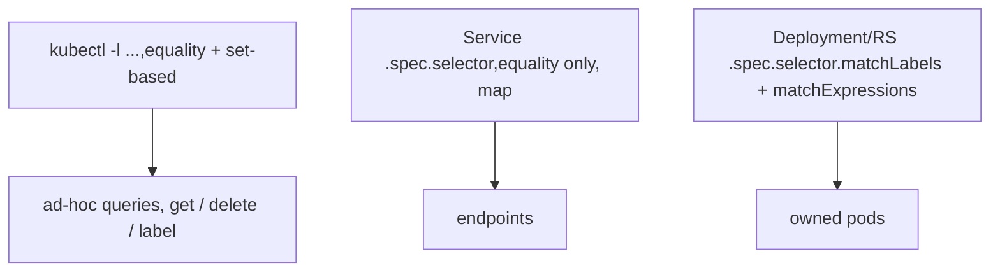

# Label selectors on the CLI

Labels (§1.4) are the glue; `-l`/`--selector` is how you query them from `kubectl`. Two syntaxes exist — *equality* and *set-based* — and not every place supports both.

## Equality-based

```bash
kubectl get pods -l app=demo                 # exactly app=demo
kubectl get pods -l app=demo,tier=web        # AND (comma = logical AND)
kubectl get pods -l tier!=cache              # not equal
kubectl get pods -l app                      # key EXISTS (any value)
kubectl get pods -l '!app'                   # key does NOT exist (quote the !)
```

## Set-based

```bash
kubectl get pods -l 'env in (prod, stage)'
kubectl get pods -l 'tier notin (cache, db)'
kubectl get pods -l 'app, env in (prod)'     # combine: app exists AND env in (prod)
```

- Commas are **AND**; there is **no OR** across keys — use `in (…)` for OR *within* one key.
- Quote anything with `!`, spaces, or `()` so the shell doesn't mangle it.

## Where selectors apply



- **`kubectl -l`** supports both syntaxes.
- **Service `.spec.selector`** is a plain `key: value` **map** — equality only, no set-based, no `matchLabels` wrapper.
- **Deployment/RS/StatefulSet `.spec.selector`** uses `matchLabels` (map) and/or `matchExpressions` (set-based: `key`, `operator: In|NotIn|Exists|DoesNotExist`, `values`).

## Real uses

```bash
kubectl delete pods -l app=demo                          # bulk delete by label
kubectl get pods -l app=demo -o name | xargs -n1 kubectl logs   # logs across a fleet
kubectl label pods -l app=demo canary=true               # tag a subset
kubectl get pods -A -l 'app in (demo, demo-db)' -o wide   # cross-namespace, multi-value
```

## Gotchas

- **Service selector mismatch = zero endpoints = no traffic** — the §1.9 classic. The Service's map must match the Pod labels the Deployment stamps.
- **A controller's `selector` is immutable** — you can't repoint a live Deployment at different labels; you'd recreate it.
- **Stray matching Pods get adopted.** A bare Pod carrying `app=demo` is counted by a ReplicaSet whose selector is `app=demo` (§1.5) — surprise scaling.
- Set-based selectors are **not** valid in a Service `.spec.selector`; only equality maps are.

## Interview angle
"Select Pods where env is prod or stage?" → `-l 'env in (prod, stage)'` (no cross-key OR exists). "Why can a Deployment use `matchExpressions` but a Service can't?" → Service selector is a plain equality map by design; richer selection lives in controllers.
