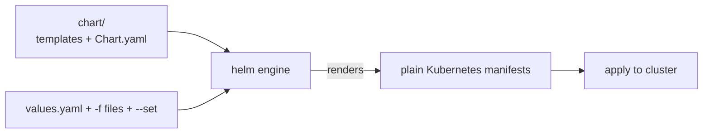
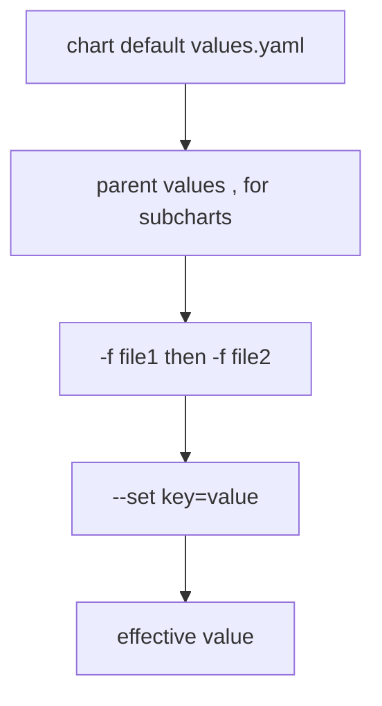
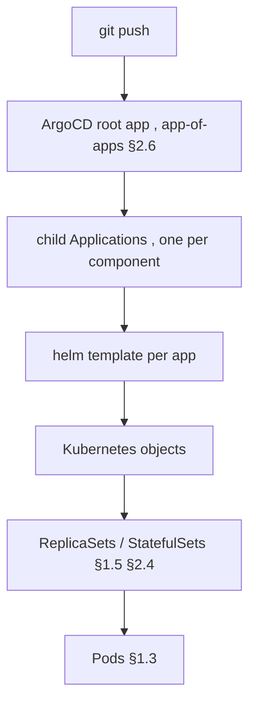
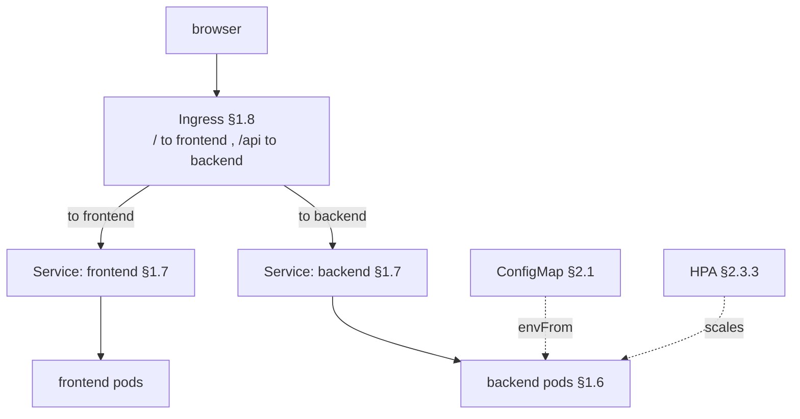
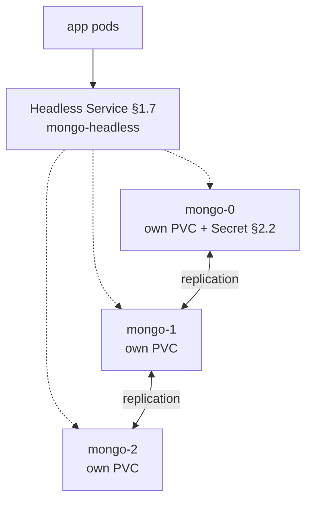
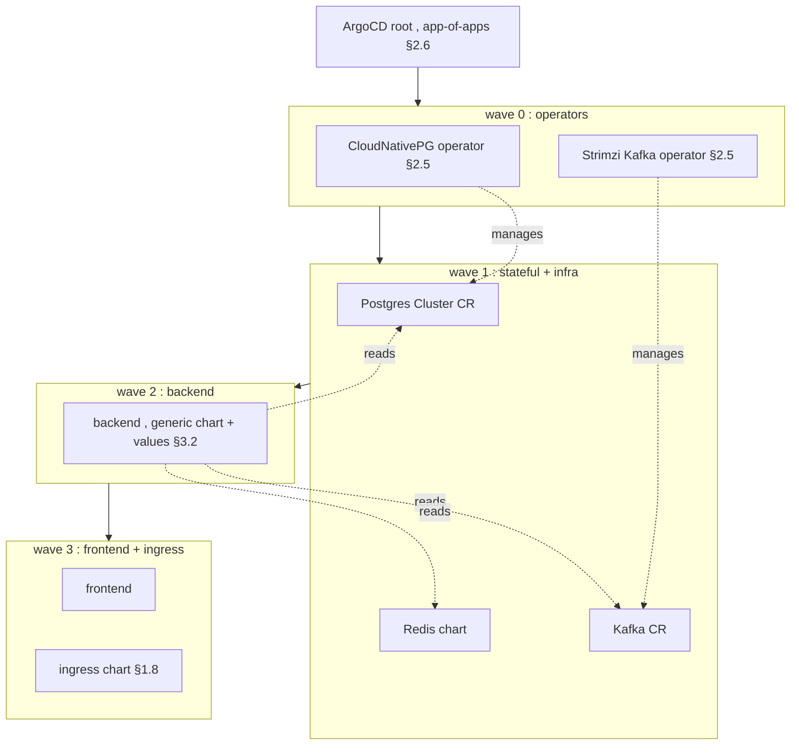
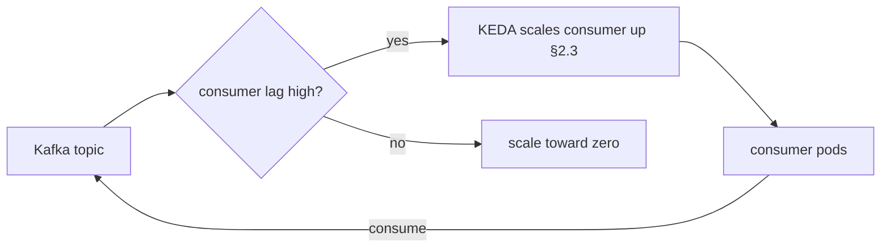

# Kubernetes Notes — Part 3: Helm + Repo Structure + Case Studies

> Same format. Case studies are **diagram-first → glue code → cross-links** — they reuse the constructs from Parts 1–2 by reference (`§1.6`, `§2.1`, …) instead of re-explaining. Current as of 2026.

**Contents:** 3.1 Helm fundamentals · 3.2 Ops-repo structure · 3.3 Case studies (CS1–CS4) · 3.4 Interview questions

---

## 3.1 Helm fundamentals

**Why:** without Helm you copy-paste near-identical YAML per app and per environment. Helm gives **templating + packaging + release tracking** — one chart, many values. **What:** a chart is a parameterized package; `values` fill the blanks; the [engine](deep:p3-helm-template-engine) renders plain manifests. (Helm 3 has been the stable line for years — no Tiller, release state in a namespaced Secret; Helm 4 is the current major. ArgoCD pins its own bundled Helm regardless.)



**Chart anatomy:**

| File / dir | Purpose |
|---|---|
| `Chart.yaml` | metadata: `name`, `version` (chart), `appVersion` (app), `dependencies` |
| `values.yaml` | default values — the override surface |
| `templates/` | Go-templated manifests |
| [`templates/_helpers.tpl`](deep:p3-helpers-tpl) | reusable named snippets (names, labels) via `define`/`include` |
| `templates/NOTES.txt` | post-install message |
| `charts/` | vendored subchart dependencies |

**[Values precedence](deep:p3-values-precedence) (low → high, last wins):**



**Edge cases that bite:** maps **deep-merge** key-by-key, but lists (`env`, `args`, `volumes`) are **replaced wholesale** — a second `-f` cannot append a list element. `--set foo=1.4.0` coerces to a float; use `--set-string` for tags. Setting a key to `null` in a higher-precedence file **deletes** the inherited default. `global:` is the only namespace that flows *down* into subcharts (see [values precedence](deep:p3-values-precedence)).

**Commands:**

| Command | Does |
|---|---|
| [`helm template`](deep:p3-helm-template-vs-install) | render to stdout, no cluster — **what ArgoCD uses** (§2.6); `lookup` returns empty, hooks become annotations |
| `helm install` | render + apply + record a **Release** |
| `helm upgrade` / `rollback` | new revision / revert |
| `helm show values <chart>` | dump default values — **authoritative** source for overrides |
| `helm list` | list Releases — **empty under ArgoCD** |

**Template engine internals (worth knowing cold):** the engine is Go `text/template` + Sprig + Helm funcs. Key built-ins in scope: `.Values`, `.Release`, `.Chart`, `.Capabilities`, `.Files`. Prefer `include "name" .` over the built-in `template` action — only `include` returns a string you can pipe (`| nindent 4`, `| sha256sum`). `required "msg" .Values.x` hard-fails on missing input; `tpl` renders a string *from values* as a template; [`lookup`](deep:p3-helm-template-engine) reads live cluster state — **but is empty under `helm template`/ArgoCD**. Whitespace chomping (`{{-` / `-}}`) is what keeps rendered YAML valid.

**Hooks vs ArgoCD phases:** Helm [hooks](deep:p3-helm-hooks) (`pre-install`/`pre-upgrade`, weights, delete-policies) run Jobs at lifecycle points and *block* — the standard DB-migration gate. Under ArgoCD they don't run as Helm hooks; ArgoCD **maps the annotations** onto its `PreSync` / `Sync` / `PostSync` phases. Phases are coarse; [sync waves](deep:p3-sync-waves) order *within* a phase — different axes.

**[Bitnami sourcing](deep:p3-bitnami-sourcing) caveat (read before picking infra charts):** in 2025 the public `docker.io/bitnami` images were frozen and moved to `docker.io/bitnamilegacy` (no CVE updates); the charts at `docker.io/bitnamicharts` still exist but reference images that moved and **need image-repo overrides**; the maintained, hardened catalog is now the paid Bitnami Secure subscription. Free off-ramps: [**Chainguard**](deep:p3-chainguard) first-party Wolfi-based forks (closest to drop-in), **bitcompat** community forks, official project charts, or operators. **Always pin chart versions** and override image references — including transitive subchart images.

**Gotchas:** `version` (chart) ≠ `appVersion` (your app). Subcharts share the parent's `values` namespace under their name; only `global:` flows down. [**Library charts**](deep:p3-library-chart) (`type: library`) ship only reusable templates, no rendered objects — the basis of the [generic chart](deep:p3-generic-chart) in §3.2/§3.3. Preview anything with `helm template ... | less` before it hits a cluster.

---

## 3.2 Ops-repo structure (GitOps)

The finalized layout: **one [generic chart](deep:p3-generic-chart)** for your services + **a routing chart** for the [single Ingress](deep:p3-ingress-ownership) + **values** per component + **ArgoCD Applications** in `apps/`.

```text
my-platform/
├── apps/                 # ArgoCD Applications (root + one per component, sync-wave annotated)
├── charts/
│   ├── app/              # ONE generic chart, reused by every service (and future projects)
│   └── ingress/          # routing chart — sole owner of the shared Ingress (§1.8)
└── values/               # config only: backend.yaml, frontend.yaml, redis.yaml, …
```



**Wiring:** the root is an [**app-of-apps**](deep:p3-app-of-apps) (§2.6) — one hand-applied Application that reads `apps/` and creates a child per component. Each child uses [**multi-source**](deep:p3-argocd-multisource) (§2.6) — the chart from one source, its `values/<svc>.yaml` from a `ref` source via `$values/...` (last source wins on duplicate resources). Ordering via [**sync waves**](deep:p3-sync-waves) (§2.6): operators → stateful infra → backend → frontend → ingress. For *templated multiplicity* (same app × many clusters, or per-PR preview envs) reach for an [**ApplicationSet**](deep:p3-applicationset) generator instead. See full SETUP.md for the canonical Application manifest.

**Gotchas:** adding a service = new `values/<svc>.yaml` + new `apps/<svc>.yaml`; the [generic chart](deep:p3-generic-chart) is untouched. Only externally-exposed HTTP services touch the [ingress chart](deep:p3-ingress-ownership) (§1.8) — one host, one Ingress, one owner. Secrets never live in Git as plaintext: use [Sealed Secrets or the External Secrets Operator](deep:p3-sealed-vs-external-secrets) (operators like CNPG/Strimzi publish their own).

---

## 3.3 Case studies

### CS1 — Stateless web app (frontend + backend + config + ingress + autoscale)



**What's happening:** the generic chart (§3.2) renders a Deployment (§1.6) + Service (§1.7) per app; config rides in via a ConfigMap consumed with `envFrom` + a checksum annotation (§2.1); the shared ingress chart owns routing (§1.8); an HPA scales the backend on CPU (§2.3.3), gated by readiness probes (§2.3.2). **Glue code** = just the values + the gated templates:

```yaml
# values/backend.yaml  (fed to charts/app)
image: { repository: registry.example.com/myorg/backend, tag: "1.4.0" }
service: { targetPort: 8080 }
config:                       # → ConfigMap, injected via envFrom (§2.1)
  KAFKA_BROKERS: kafka-bootstrap:9092
  REDIS_URL: redis://redis-master:6379
ingress: { enabled: false }   # routing lives in charts/ingress (§1.8)
autoscaling:
  enabled: true
  minReplicas: 2
  maxReplicas: 10
  targetCPUUtilizationPercentage: 70
readinessProbe: { httpGet: { path: /healthz, port: 8080 } }  # §2.3.2
```

```yaml
# charts/app/templates/hpa.yaml  (gated, so the chart stays generic)
{{- if .Values.autoscaling.enabled }}
apiVersion: autoscaling/v2
kind: HorizontalPodAutoscaler
spec:
  scaleTargetRef: { apiVersion: apps/v1, kind: Deployment, name: {{ include "app.fullname" . }} }
  minReplicas: {{ .Values.autoscaling.minReplicas }}
  maxReplicas: {{ .Values.autoscaling.maxReplicas }}
  metrics:
    - type: Resource
      resource: { name: cpu, target: { type: Utilization, averageUtilization: {{ .Values.autoscaling.targetCPUUtilizationPercentage }} } }
{{- end }}
```

```yaml
# charts/ingress/templates/ingress.yaml  (the single owner, §1.8)
spec:
  rules:
    - host: app.example.com
      http:
        paths:
          - { path: /,    pathType: Prefix, backend: { service: { name: frontend, port: { number: 80 } } } }
          - { path: /api, pathType: Prefix, backend: { service: { name: backend,  port: { number: 80 } } } }
```

### CS2 — Stateful service (MongoDB, by hand, to see the primitives)



**What's happening:** a StatefulSet (§2.4) gives stable names `mongo-0..2`, each with its **own** PVC (not shared) and stable DNS via a **headless** Service (§1.7); credentials come from a Secret (§2.2). **Glue code:**

```yaml
# headless Service — clusterIP: None gives per-pod DNS (§1.7)
apiVersion: v1
kind: Service
metadata: { name: mongo-headless }
spec: { clusterIP: None, selector: { app: mongo }, ports: [{ port: 27017 }] }
---
apiVersion: apps/v1
kind: StatefulSet
metadata: { name: mongo }
spec:
  serviceName: mongo-headless          # ties to the headless Service
  replicas: 3
  selector: { matchLabels: { app: mongo } }
  template:
    metadata: { labels: { app: mongo } }
    spec:
      containers:
        - name: mongo
          image: mongo:7
          ports: [{ containerPort: 27017 }]
          envFrom: [{ secretRef: { name: mongo-creds } }]   # §2.2
          volumeMounts: [{ name: data, mountPath: /data/db }]
  volumeClaimTemplates:                # one PVC PER pod (§2.4)
    - metadata: { name: data }
      spec: { accessModes: [ReadWriteOnce], resources: { requests: { storage: 20Gi } } }
```

> In production you'd usually let an **operator** run Mongo (failover, backups) — which is exactly what CS3 does for Postgres via [CloudNativePG](deep:p3-cloudnativepg). A StatefulSet gives identity + storage; an operator (§2.5) adds the Day-2 logic.

### CS3 — Capstone: full app via ArgoCD (operators + app-of-apps + waves)

Replacing the earlier Yugabyte stack (SETUP.md is reconciled to this): **Go backend + Vite frontend + PostgreSQL ([CloudNativePG operator](deep:p3-cloudnativepg)) + Kafka ([Strimzi operator](deep:p3-strimzi)) + Redis**.



**What's happening:** operators install first (wave 0) so their **CRDs exist** before any CR is applied; their CRs (a Postgres `Cluster`, a `Kafka`) come up in wave 1 alongside Redis; then backend, then frontend + ingress ([§2.6 waves](deep:p3-sync-waves)). Note the subtlety: a CR without a registered ArgoCD **health check** may be reported Healthy immediately, so the next wave can start before the DB is truly live — waves order the *deploy*, not *runtime*, so the backend still needs retry. The backend reads everything over ClusterIP DNS (§1.7) — e.g. CNPG's primary-tracking `app-db-rw` Service — no ingress on the data services ([§1.8 gotcha](deep:p3-ingress-ownership)). **Glue code** = the ArgoCD Applications and the CRs:

```yaml
# apps/postgres-operator.yaml — wave 0 (CRDs must exist before the CR)
metadata:
  name: postgres-operator
  annotations: { argocd.argoproj.io/sync-wave: "0" }
spec:
  source: { repoURL: https://cloudnative-pg.github.io/charts, chart: cloudnative-pg, targetRevision: 0.x.x }
  destination: { server: https://kubernetes.default.svc, namespace: cnpg-system }
  syncPolicy: { automated: { prune: true, selfHeal: true }, syncOptions: [CreateNamespace=true] }
---
# apps/postgres.yaml — wave 1 (the CR the operator reconciles, §2.5)
metadata:
  name: postgres
  annotations: { argocd.argoproj.io/sync-wave: "1" }
# source points at a tiny chart/manifest containing:
#   apiVersion: postgresql.cnpg.io/v1
#   kind: Cluster
#   spec: { instances: 3, storage: { size: 20Gi } }
---
# apps/backend.yaml — wave 2, generic chart + its values (multi-source, §2.6 / §3.2)
metadata:
  name: backend
  annotations: { argocd.argoproj.io/sync-wave: "2" }
spec:
  sources:
    - { repoURL: https://github.com/you/my-platform.git, targetRevision: main, path: charts/app,
        helm: { valueFiles: ["$values/values/backend.yaml"] } }   # $values resolves to the ref source below
    - { repoURL: https://github.com/you/my-platform.git, targetRevision: main, ref: values }   # no path -> renders nothing, just mounts the repo as $values
```

Backend config/secrets reuse CS1's pattern (ConfigMap §2.1 + Secret §2.2); Postgres credentials are published by the operator as a Secret the backend mounts — no [Sealed/External secret](deep:p3-sealed-vs-external-secrets) needed for those. The frontend's API URL is *not* baked in: it uses same-origin `/api` via the ingress, sidestepping the [Vite build-time-env gotcha](deep:p3-vite-runtime-config).

### CS4 — Async worker (Kafka consumer, autoscaled on lag)



**What's happening:** a plain Deployment (§1.6) of consumers, but scaled by [**KEDA**](deep:p3-keda-scaledobject) (a CNCF Graduated project) on Kafka **lag** rather than CPU — the right signal for queue workers. KEDA drives an HPA it creates; KEDA itself owns the `0↔1` activation, so it can **scale to zero** when idle (which a bare HPA cannot). Cap `maxReplicaCount` at the topic's partition count — extra consumers in a group sit idle. **Glue code:**

```yaml
apiVersion: keda.sh/v1alpha1
kind: ScaledObject
spec:
  scaleTargetRef: { name: order-consumer }   # the Deployment
  minReplicaCount: 0
  maxReplicaCount: 20
  triggers:
    - type: kafka
      metadata: { bootstrapServers: kafka-bootstrap:9092, consumerGroup: orders, topic: orders, lagThreshold: "100" }
```

---

## 3.4 Interview questions (synthesis)

**Q1. Why does ArgoCD use [`helm template`](deep:p3-helm-template-vs-install) not `helm install`, and how does that change debugging?**
ArgoCD renders + applies + reconciles itself, so there's no Helm Release (§3.1, §2.6) — `helm list` is empty and you debug with `argocd app manifests` / `kubectl`, not `helm get`. Rollback is a Git revert, not `helm rollback`. [Hooks](deep:p3-helm-hooks) map to ArgoCD sync phases, and `lookup` returns empty at render — so `lookup`-based password generation silently misbehaves.

**Q2. You add a sixth microservice. What changes in the repo, what doesn't?**
Add `values/<svc>.yaml` + `apps/<svc>.yaml` (§3.2); the **generic chart is untouched** (§3.1 library/generic idea). Touch the ingress chart only if it's externally exposed (§1.8).

**Q3. An upstream chart's pods are stuck `ImagePullBackOff` after a redeploy. Diagnose.**
Likely the [Bitnami legacy/deprecation issue](deep:p3-bitnami-sourcing) (§3.1): the chart references images that moved to the frozen `bitnamilegacy` repo. Fix by overriding the image repo ([Chainguard](deep:p3-chainguard) Wolfi forks, bitcompat, a mirror, or your own registry) and pinning versions — check transitive subchart images too. Ties to Pod image pull (§1.3).

**Q4. [Generic chart](deep:p3-generic-chart) vs per-app chart vs [library chart](deep:p3-library-chart) — when each?**
Generic chart + values for many similar services (§3.2); per-app chart when one service needs unique *templates*; library chart (`type: library`, §3.1) when several charts share template *logic* but differ structurally.

**Q5. How do you make sure Postgres is ready before the backend that depends on it?**
[Sync waves](deep:p3-sync-waves) order the *apply* (operator → CR → backend, §2.6/§3.2/§2.5) and ArgoCD waits for Healthy between waves — but a CR with no registered health check is reported Healthy immediately, and K8s has no runtime `depends_on`, so you still design the backend to **retry** (§2.3); CNPG even keeps the connection string stable across failover via the `-rw` Service.

**Q6. Two values files set the same key — who wins? How does that mirror ArgoCD multi-source?**
Last `-f` wins for scalars/maps, but [lists are replaced wholesale, maps deep-merge](deep:p3-values-precedence) (§3.1). Analogously, in a [multi-source](deep:p3-argocd-multisource) Application the **last source wins** on duplicate *resources* (with a `RepeatedResourceWarning`, §2.6). Same "last writer wins" mental model, two different layers.

**Q7. In CS1 the browser gets 502/404 on `/api`. Walk the layers.**
Ingress rule for `/api` missing/typo (§1.8) → or backend Service has no Ready endpoints because readiness is failing (§2.3.2, §1.7) → or `targetPort` mismatch → or the backend pods are crashlooping. Check rule → endpoints → pod.

**Q8. Why run Postgres via an operator+CR (CS3) but Mongo via a raw StatefulSet (CS2)?**
A StatefulSet (§2.4) gives identity + storage but no Day-2 logic; an [operator](deep:p3-cloudnativepg) (§2.5) adds failover, backups, and safe scaling encoded as a controller, and a primary-tracking `-rw` Service. CS2 shows the primitives; CS3 shows the production pattern.

**Q9. Setting `VITE_API_URL` on the running frontend pod does nothing. Why, and how do you make the SPA configurable?**
Vite [inlines `import.meta.env.VITE_*` at **build time**](deep:p3-vite-runtime-config) into the bundle inside the image — a pod env var is read too late. Fixes: a container entrypoint that `envsubst`s a runtime `config.js` (`window.__ENV__`), so config becomes a ConfigMap/chart concern again (§2.1); or simpler, **same-origin `/api`** via the single [Ingress](deep:p3-ingress-ownership) so no backend URL is baked at all. This is also why one [generic chart](deep:p3-generic-chart) serves both frontend and backend — the frontend's only special behaviour lives in its *image*.

**Q10. CPU-based HPA (CS1) vs KEDA (CS4) — why two autoscalers, and what can KEDA do that an HPA can't?**
CPU HPA (§2.3.3) fits request-serving services where load ≈ CPU; for a queue worker the true backlog signal is **lag/depth**, so [KEDA](deep:p3-keda-scaledobject) scales on Kafka consumer lag and — crucially — **scales to zero** (KEDA owns the `0↔1` activation; a bare HPA stops at 1). KEDA actually *creates and drives* an HPA above 1. Cap replicas at the topic's partition count, and expect cold starts from zero.

**Q11. You need the same service deployed to 20 clusters, plus an ephemeral preview env per pull request. App-of-apps or ApplicationSet?**
[App-of-apps](deep:p3-app-of-apps) hand-assembles a *heterogeneous* stack (one Application file each). For *templated multiplicity* use an [ApplicationSet](deep:p3-applicationset): the `clusters` generator fans the app across the fleet, and the `pullRequest` generator spins up/prunes a preview env per open PR. They compose. Mind the cascade-delete blast radius — guard with an AppProject and `preserveResourcesOnDeletion`.
