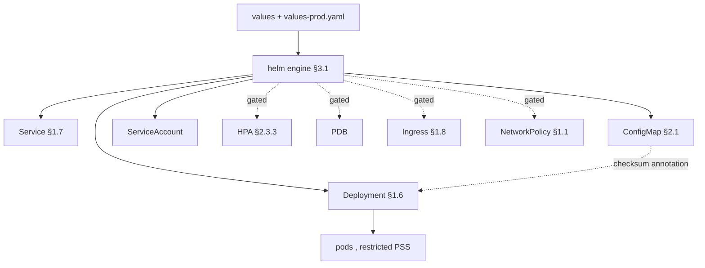
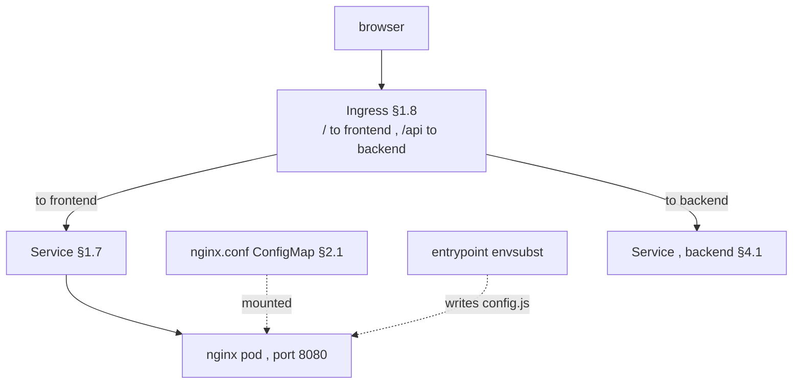

# Kubernetes Notes — Part 4: Reference Helm Charts

> Two production-grade, copy-paste-ready reference charts built on the [generic chart](deep:p3-generic-chart) idea from §3.2. Same format, but the deliverable here is **complete chart files** with the thinking inline: each meaningful decision gets **Options → Tradeoffs → Why this default**. Current as of 2026 (K8s 1.36, Helm 4 — chart `apiVersion: v2` is still the standard; Pod Security Standards **restricted** is the security bar).

**Contents:** 4.1 Go backend chart (`charts/app`) · 4.2 React SPA frontend chart

> **How both charts relate to Part 3:** this *is* the `charts/app` generic chart (§3.2). One chart, two value-shapes — backend and frontend differ only in image + a few values (§3.4 Q4, [generic chart](deep:p3-generic-chart)). Everything optional is **gated and off by default** so the chart stays generic ([values design](deep:p4-values-design)).

---

## 4.1 Go backend chart (`charts/app`)

A generic chart usable for any Go service: secure-by-default [securityContext](deep:p4-securitycontext), tuned [probes](deep:p4-probes-tuning), gated [HPA](deep:p4-hpa-config)/[PDB](deep:p4-pdb-config)/[Ingress](deep:p3-ingress-ownership)/[NetworkPolicy](deep:p4-networkpolicy)/[ServiceMonitor](deep:p4-servicemonitor), and the [checksum rollout](deep:p4-helm-checksum-rollout) pattern.



### Chart.yaml

`apiVersion: v2` (Helm 3+/4), `type: application`. The key distinction (§3.1 gotcha): **`version`** is the *chart's* version (bump on any template/values change), **`appVersion`** tracks the *app image* you ship — they move independently.

```yaml
apiVersion: v2
name: app
description: Generic chart for any first-party Go/HTTP service
type: application        # vs "library" (§3.1) — this one renders objects
version: 0.1.0           # CHART version — bump on template/values change
appVersion: "1.0.0"      # APP version — mirrors the default image tag
kubeVersion: ">=1.30.0-0"
```

### values.yaml

The override surface — every knob configurable, secure defaults ([values design](deep:p4-values-design)). Read this top-to-bottom: it *is* the chart's API.

```yaml
# -- Image. Pin by digest in prod; never floating tags (§3.1, image hardening).
image:
  repository: registry.example.com/myorg/backend
  tag: ""                       # defaults to .Chart.AppVersion if empty
  pullPolicy: IfNotPresent      # Always only for mutable tags (avoid those)
imagePullSecrets: []            # [{ name: regcred }] for private registries

nameOverride: ""
fullnameOverride: ""

replicaCount: 2                 # ignored when autoscaling.enabled (HPA config)

# -- Resources. Memory request==limit (predictable OOM); CPU request only,
#    no CPU limit (avoid idle throttling). See p4-resources-requests-limits.
resources:
  requests: { cpu: 100m, memory: 128Mi }
  limits:   { memory: 128Mi }   # no cpu limit on purpose

# -- Autoscaling (gated, autoscaling/v2). Off → replicaCount applies.
autoscaling:
  enabled: false
  minReplicas: 2
  maxReplicas: 10
  targetCPUUtilizationPercentage: 70

# -- Pod & container securityContext: restricted PSS by default (p4-securitycontext).
podSecurityContext:
  runAsNonRoot: true
  runAsUser: 10001
  runAsGroup: 10001
  fsGroup: 10001
  seccompProfile: { type: RuntimeDefault }
securityContext:
  allowPrivilegeEscalation: false
  readOnlyRootFilesystem: true          # needs emptyDir for /tmp (see volumes)
  capabilities: { drop: ["ALL"] }

# -- Probes (p4-probes-tuning). Liveness & readiness use DIFFERENT endpoints.
startupProbe:
  httpGet: { path: /healthz, port: http }
  failureThreshold: 30
  periodSeconds: 10
livenessProbe:
  httpGet: { path: /healthz, port: http }
  periodSeconds: 10
  failureThreshold: 3
readinessProbe:
  httpGet: { path: /readyz, port: http }
  periodSeconds: 5
  failureThreshold: 3

# -- Service (§1.7)
service:
  type: ClusterIP               # ClusterIP for internal; Ingress fronts HTTP
  port: 80
  targetPort: 8080              # container listen port

# -- ServiceAccount
serviceAccount:
  create: true
  name: ""
  annotations: {}               # e.g. IRSA / Workload Identity role ARN

# -- Config → ConfigMap, injected via envFrom (§2.1). NON-secret only.
config:
  LOG_LEVEL: info
  HTTP_PORT: "8080"
# Structured env (rendered into env list)
env: {}                         # { KEY: value }
# Raw passthrough for valueFrom / fieldRef (lists don't merge — p4-values-design)
extraEnv: []                    # [{ name: X, valueFrom: { secretKeyRef: {...} } }]
# Pull whole ConfigMaps/Secrets as env
envFrom: []                     # [{ secretRef: { name: backend-secrets } }]

# -- Ingress (gated, OFF). Routing usually lives in charts/ingress (§1.8, §3.2).
ingress:
  enabled: false
  className: nginx
  annotations: {}
  hosts:
    - host: app.example.com
      paths: [{ path: /, pathType: Prefix }]
  tls: []

# -- PodDisruptionBudget (gated). Set minAvailable OR maxUnavailable, not both.
pdb:
  enabled: false
  minAvailable: 1
  maxUnavailable: ""

# -- Spread across zones+nodes (soft). p4-topology-spread.
topologySpreadConstraints:
  - maxSkew: 1
    topologyKey: topology.kubernetes.io/zone
    whenUnsatisfiable: ScheduleAnyway
    labelSelector: {}           # auto-filled with selectorLabels in template
  - maxSkew: 1
    topologyKey: kubernetes.io/hostname
    whenUnsatisfiable: ScheduleAnyway
    labelSelector: {}

nodeSelector: {}
tolerations: []
affinity: {}

# -- Rollout strategy (p4-rollout-strategy). Surge before evict.
strategy:
  type: RollingUpdate
  rollingUpdate: { maxSurge: 25%, maxUnavailable: 0 }

# -- Graceful shutdown: preStop drain + grace period (p4-rollout-strategy).
terminationGracePeriodSeconds: 30
lifecycle:
  preStop:
    exec: { command: ["/bin/sh", "-c", "sleep 5"] }

# -- Writable dirs under readOnlyRootFilesystem (p4-securitycontext).
volumes:
  - name: tmp
    emptyDir: {}
volumeMounts:
  - { name: tmp, mountPath: /tmp }

# -- Extra pod annotations. checksum/config is added automatically in the template.
podAnnotations: {}
podLabels: {}

# -- Observability (gated, Prometheus Operator). p4-servicemonitor.
serviceMonitor:
  enabled: false
  path: /metrics
  port: http
  interval: 30s
  releaseLabel: kube-prometheus-stack

# -- East-west firewall (gated). p4-networkpolicy. Remember DNS egress!
networkPolicy:
  enabled: false
```

**Key default decisions — Options → Tradeoffs → Why:**

| Decision | Options | Why this default |
|---|---|---|
| QoS / resources | Guaranteed (req==lim all) vs **Burstable** (mem req==lim, no cpu lim) | Burstable: predictable OOM (mem locked) + no idle CPU throttling; flip to Guaranteed for latency-critical singletons in prod ([resources](deep:p4-resources-requests-limits)) |
| Rollout | **RollingUpdate** vs Recreate | stateless HTTP → zero-downtime rolling; Recreate only for schema-incompatible or RWO single-writer ([rollout](deep:p4-rollout-strategy)) |
| maxUnavailable | **0** vs 1/% | 0 = never dip below capacity (surge first); needs headroom ([rollout](deep:p4-rollout-strategy)) |
| Root FS | rw vs **readOnly** | readOnly = restricted PSS + smaller blast radius; cost is an `emptyDir` for `/tmp` ([securityContext](deep:p4-securitycontext)) |
| Spread | **topologySpread (soft)** vs podAntiAffinity | spread scales + tunable skew; soft avoids Pending pods ([topology spread](deep:p4-topology-spread)) |
| Autoscale signal | **CPU** vs custom/RPS vs KEDA | CPU needs only metrics-server; RPS needs an adapter; queue-lag → KEDA (§3.3 CS4, [HPA config](deep:p4-hpa-config)) |
| PDB | **minAvailable** vs maxUnavailable | minAvailable for fixed pools; switch to `%`/maxUnavailable under HPA ([PDB](deep:p4-pdb-config)) |

### templates/_helpers.tpl

Names, labels, selectorLabels, serviceAccountName — the reusable snippets ([helpers.tpl](deep:p3-helpers-tpl)) every other template `include`s.

```text
{{/* Chart name (overridable). */}}
{{- define "app.name" -}}
{{- default .Chart.Name .Values.nameOverride | trunc 63 | trimSuffix "-" -}}
{{- end -}}

{{/* Fully qualified name: release-chart, capped at 63 chars (DNS limit). */}}
{{- define "app.fullname" -}}
{{- if .Values.fullnameOverride -}}
{{- .Values.fullnameOverride | trunc 63 | trimSuffix "-" -}}
{{- else -}}
{{- $name := default .Chart.Name .Values.nameOverride -}}
{{- printf "%s-%s" .Release.Name $name | trunc 63 | trimSuffix "-" -}}
{{- end -}}
{{- end -}}

{{/* Common labels (recommended app.kubernetes.io set). */}}
{{- define "app.labels" -}}
helm.sh/chart: {{ printf "%s-%s" .Chart.Name .Chart.Version | replace "+" "_" | trunc 63 | trimSuffix "-" }}
{{ include "app.selectorLabels" . }}
app.kubernetes.io/version: {{ .Chart.AppVersion | quote }}
app.kubernetes.io/managed-by: {{ .Release.Service }}
{{- end -}}

{{/* Selector labels — IMMUTABLE; never add version here (§1.4). */}}
{{- define "app.selectorLabels" -}}
app.kubernetes.io/name: {{ include "app.name" . }}
app.kubernetes.io/instance: {{ .Release.Name }}
{{- end -}}

{{/* ServiceAccount name. */}}
{{- define "app.serviceAccountName" -}}
{{- if .Values.serviceAccount.create -}}
{{- default (include "app.fullname" .) .Values.serviceAccount.name -}}
{{- else -}}
{{- default "default" .Values.serviceAccount.name -}}
{{- end -}}
{{- end -}}
```

> **Why `selectorLabels` excludes version:** the Deployment's `selector` is **immutable** (§1.4). Putting `app.kubernetes.io/version` in selector labels would make every version bump an illegal selector change. Common labels (for humans/queries) include version; *selector* labels do not.

### templates/deployment.yaml

The heart of the chart: [checksum annotation](deep:p4-helm-checksum-rollout), restricted [securityContext](deep:p4-securitycontext), three [probes](deep:p4-probes-tuning), resources, [strategy](deep:p4-rollout-strategy), [topology spread](deep:p4-topology-spread), graceful shutdown.

```yaml
apiVersion: apps/v1
kind: Deployment
metadata:
  name: {{ include "app.fullname" . }}
  labels: {{- include "app.labels" . | nindent 4 }}
spec:
  {{- if not .Values.autoscaling.enabled }}
  replicas: {{ .Values.replicaCount }}      # omitted when HPA owns it (p4-hpa-config)
  {{- end }}
  strategy: {{- toYaml .Values.strategy | nindent 4 }}
  selector:
    matchLabels: {{- include "app.selectorLabels" . | nindent 6 }}
  template:
    metadata:
      annotations:
        # Roll pods when ConfigMap content changes (p4-helm-checksum-rollout, §2.1)
        checksum/config: {{ include (print $.Template.BasePath "/configmap.yaml") . | sha256sum }}
        {{- with .Values.podAnnotations }}
        {{- toYaml . | nindent 8 }}
        {{- end }}
      labels:
        {{- include "app.selectorLabels" . | nindent 8 }}
        {{- with .Values.podLabels }}
        {{- toYaml . | nindent 8 }}
        {{- end }}
    spec:
      serviceAccountName: {{ include "app.serviceAccountName" . }}
      {{- with .Values.imagePullSecrets }}
      imagePullSecrets: {{- toYaml . | nindent 8 }}
      {{- end }}
      securityContext: {{- toYaml .Values.podSecurityContext | nindent 8 }}
      terminationGracePeriodSeconds: {{ .Values.terminationGracePeriodSeconds }}
      containers:
        - name: {{ .Chart.Name }}
          image: "{{ .Values.image.repository }}:{{ .Values.image.tag | default .Chart.AppVersion }}"
          imagePullPolicy: {{ .Values.image.pullPolicy }}
          securityContext: {{- toYaml .Values.securityContext | nindent 12 }}
          ports:
            - { name: http, containerPort: {{ .Values.service.targetPort }}, protocol: TCP }
          envFrom:
            - configMapRef: { name: {{ include "app.fullname" . }}-config }
            {{- with .Values.envFrom }}
            {{- toYaml . | nindent 12 }}
            {{- end }}
          {{- with .Values.env }}
          env:
            {{- range $k, $v := . }}
            - { name: {{ $k }}, value: {{ $v | quote }} }
            {{- end }}
            {{- with $.Values.extraEnv }}
            {{- toYaml . | nindent 12 }}
            {{- end }}
          {{- else }}{{- with .Values.extraEnv }}
          env: {{- toYaml . | nindent 12 }}
          {{- end }}{{- end }}
          {{- with .Values.startupProbe }}
          startupProbe: {{- toYaml . | nindent 12 }}
          {{- end }}
          {{- with .Values.livenessProbe }}
          livenessProbe: {{- toYaml . | nindent 12 }}
          {{- end }}
          {{- with .Values.readinessProbe }}
          readinessProbe: {{- toYaml . | nindent 12 }}
          {{- end }}
          resources: {{- toYaml .Values.resources | nindent 12 }}
          {{- with .Values.lifecycle }}
          lifecycle: {{- toYaml . | nindent 12 }}
          {{- end }}
          {{- with .Values.volumeMounts }}
          volumeMounts: {{- toYaml . | nindent 12 }}
          {{- end }}
      {{- with .Values.volumes }}
      volumes: {{- toYaml . | nindent 8 }}
      {{- end }}
      {{- with .Values.nodeSelector }}
      nodeSelector: {{- toYaml . | nindent 8 }}
      {{- end }}
      {{- with .Values.tolerations }}
      tolerations: {{- toYaml . | nindent 8 }}
      {{- end }}
      {{- with .Values.affinity }}
      affinity: {{- toYaml . | nindent 8 }}
      {{- end }}
      {{- with .Values.topologySpreadConstraints }}
      topologySpreadConstraints:
        {{- range . }}
        - maxSkew: {{ .maxSkew }}
          topologyKey: {{ .topologyKey }}
          whenUnsatisfiable: {{ .whenUnsatisfiable }}
          labelSelector:
            matchLabels: {{- include "app.selectorLabels" $ | nindent 14 }}
        {{- end }}
      {{- end }}
```

> **Why `labelSelector` is auto-filled with `selectorLabels`:** a topology spread constraint whose selector doesn't match the pod's own labels silently does nothing ([topology spread](deep:p4-topology-spread) gotcha). The template injects the correct selector so callers can't get it wrong.

### templates/service.yaml

```yaml
apiVersion: v1
kind: Service
metadata:
  name: {{ include "app.fullname" . }}
  labels: {{- include "app.labels" . | nindent 4 }}
spec:
  type: {{ .Values.service.type }}
  selector: {{- include "app.selectorLabels" . | nindent 4 }}
  ports:
    - name: http               # NAMED — required for ServiceMonitor (p4-servicemonitor)
      port: {{ .Values.service.port }}
      targetPort: http         # matches the container port name in the Deployment
      protocol: TCP
```

### templates/serviceaccount.yaml

```yaml
{{- if .Values.serviceAccount.create }}
apiVersion: v1
kind: ServiceAccount
metadata:
  name: {{ include "app.serviceAccountName" . }}
  labels: {{- include "app.labels" . | nindent 4 }}
  {{- with .Values.serviceAccount.annotations }}
  annotations: {{- toYaml . | nindent 4 }}    # e.g. IRSA / Workload Identity
  {{- end }}
{{- end }}
```

### templates/configmap.yaml

Non-secret config; consumed via `envFrom` (§2.1). Its rendered content feeds the [checksum annotation](deep:p4-helm-checksum-rollout).

```yaml
apiVersion: v1
kind: ConfigMap
metadata:
  name: {{ include "app.fullname" . }}-config
  labels: {{- include "app.labels" . | nindent 4 }}
data:
  {{- range $k, $v := .Values.config }}
  {{ $k }}: {{ $v | quote }}
  {{- end }}
```

> **Why config in a ConfigMap, not inline env:** centralizing it makes the [checksum rollout](deep:p4-helm-checksum-rollout) work (hash one object) and keeps secrets out of the Deployment spec. Secrets go via `envFrom`/`extraEnv` pointing at a Secret managed by [Sealed Secrets / ESO](deep:p3-sealed-vs-external-secrets) (§3.2) — never in this ConfigMap.

### templates/hpa.yaml

Gated, `autoscaling/v2` ([HPA config](deep:p4-hpa-config)). Note the deployment omits `replicas` when this is on.

```yaml
{{- if .Values.autoscaling.enabled }}
apiVersion: autoscaling/v2
kind: HorizontalPodAutoscaler
metadata:
  name: {{ include "app.fullname" . }}
  labels: {{- include "app.labels" . | nindent 4 }}
spec:
  scaleTargetRef:
    apiVersion: apps/v1
    kind: Deployment
    name: {{ include "app.fullname" . }}
  minReplicas: {{ .Values.autoscaling.minReplicas }}
  maxReplicas: {{ .Values.autoscaling.maxReplicas }}
  metrics:
    - type: Resource
      resource:
        name: cpu
        target: { type: Utilization, averageUtilization: {{ .Values.autoscaling.targetCPUUtilizationPercentage }} }
  behavior:
    scaleDown:
      stabilizationWindowSeconds: 300     # damp flapping (p4-hpa-config)
{{- end }}
```

### templates/pdb.yaml

Gated. `minAvailable` XOR `maxUnavailable` ([PDB config](deep:p4-pdb-config)).

```yaml
{{- if .Values.pdb.enabled }}
apiVersion: policy/v1
kind: PodDisruptionBudget
metadata:
  name: {{ include "app.fullname" . }}
  labels: {{- include "app.labels" . | nindent 4 }}
spec:
  {{- if .Values.pdb.maxUnavailable }}
  maxUnavailable: {{ .Values.pdb.maxUnavailable }}
  {{- else }}
  minAvailable: {{ .Values.pdb.minAvailable }}
  {{- end }}
  selector:
    matchLabels: {{- include "app.selectorLabels" . | nindent 6 }}
{{- end }}
```

### templates/ingress.yaml

Gated, `networking.k8s.io/v1`, **off by default** — routing usually belongs to the single [ingress chart](deep:p3-ingress-ownership) (§1.8, §3.2).

```yaml
{{- if .Values.ingress.enabled }}
apiVersion: networking.k8s.io/v1
kind: Ingress
metadata:
  name: {{ include "app.fullname" . }}
  labels: {{- include "app.labels" . | nindent 4 }}
  {{- with .Values.ingress.annotations }}
  annotations: {{- toYaml . | nindent 4 }}
  {{- end }}
spec:
  ingressClassName: {{ .Values.ingress.className }}
  {{- with .Values.ingress.tls }}
  tls: {{- toYaml . | nindent 4 }}
  {{- end }}
  rules:
    {{- range .Values.ingress.hosts }}
    - host: {{ .host | quote }}
      http:
        paths:
          {{- range .paths }}
          - path: {{ .path }}
            pathType: {{ .pathType }}
            backend:
              service:
                name: {{ include "app.fullname" $ }}
                port: { number: {{ $.Values.service.port }} }
          {{- end }}
    {{- end }}
{{- end }}
```

### templates/networkpolicy.yaml + servicemonitor.yaml

Both gated, both off by default — full bodies and the failure modes are in [networkpolicy](deep:p4-networkpolicy) and [servicemonitor](deep:p4-servicemonitor). Skeletons:

```yaml
{{- if .Values.networkPolicy.enabled }}
apiVersion: networking.k8s.io/v1
kind: NetworkPolicy
metadata: { name: {{ include "app.fullname" . }}, labels: {{- include "app.labels" . | nindent 4 }} }
spec:
  podSelector: { matchLabels: {{- include "app.selectorLabels" . | nindent 6 }} }
  policyTypes: [Ingress, Egress]
  egress:                                   # ALWAYS allow DNS or everything hangs!
    - to: [{ namespaceSelector: { matchLabels: { kubernetes.io/metadata.name: kube-system } } }]
      ports: [{ protocol: UDP, port: 53 }, { protocol: TCP, port: 53 }]
{{- end }}
```

```yaml
{{- if .Values.serviceMonitor.enabled }}
apiVersion: monitoring.coreos.com/v1
kind: ServiceMonitor
metadata:
  name: {{ include "app.fullname" . }}
  labels:
    {{- include "app.labels" . | nindent 4 }}
    release: {{ .Values.serviceMonitor.releaseLabel }}   # MUST match Prometheus selector
spec:
  selector: { matchLabels: {{- include "app.selectorLabels" . | nindent 6 }} }
  endpoints:
    - { port: {{ .Values.serviceMonitor.port }}, path: {{ .Values.serviceMonitor.path }}, interval: {{ .Values.serviceMonitor.interval }} }
{{- end }}
```

### templates/NOTES.txt

Post-install message (printed by `helm install`; ArgoCD ignores it, §3.1).

```text
{{ .Chart.Name }} ({{ include "app.fullname" . }}) deployed.

Replicas:    {{ if .Values.autoscaling.enabled }}HPA {{ .Values.autoscaling.minReplicas }}-{{ .Values.autoscaling.maxReplicas }}{{ else }}{{ .Values.replicaCount }}{{ end }}
Service:     {{ include "app.fullname" . }}.{{ .Release.Namespace }}.svc.cluster.local:{{ .Values.service.port }}
{{ if not .Values.ingress.enabled }}No Ingress (routing lives in the shared ingress chart, §1.8).{{ end }}

Check readiness:
  kubectl -n {{ .Release.Namespace }} rollout status deploy/{{ include "app.fullname" . }}
```

### Dockerfile (Go, multi-stage, distroless nonroot)

Image hardening drives the chart's `runAsNonRoot`/`readOnlyRootFilesystem` choices — see [image hardening](deep:p4-image-hardening).

```dockerfile
# --- build stage ---
FROM golang:1.24 AS build
WORKDIR /src
COPY go.mod go.sum ./
RUN go mod download
COPY . .
# static binary -> no libc needed at runtime
RUN CGO_ENABLED=0 GOOS=linux go build -trimpath -ldflags="-s -w" -o /app ./cmd/server

# --- runtime stage ---
FROM gcr.io/distroless/static:nonroot
COPY --from=build /app /app
USER 65532:65532          # numeric nonroot UID — REQUIRED for runAsNonRoot to pass
EXPOSE 8080
ENTRYPOINT ["/app"]
```

| Decision | Options | Why |
|---|---|---|
| Base image | alpine vs **distroless/static** vs scratch | distroless nonroot: ~2MB, no shell, CVE-minimal, ships a numeric nonroot user; alpine reintroduces busybox+musl issues ([image hardening](deep:p4-image-hardening)) |
| `CGO_ENABLED=0` | static vs dynamic | static binary runs on `distroless/static` (no libc); avoids musl DNS/cgo quirks |
| numeric `USER` | named vs **65532** | kubelet can only verify a *numeric* non-zero UID for `runAsNonRoot` ([securityContext](deep:p4-securitycontext)) |

### values-prod.yaml (override)

What you'd layer on for production (§3.1 precedence, last `-f` wins).

```yaml
image:
  tag: "1.4.0"                  # pinned; ideally a @sha256 digest
replicaCount: 3
resources:                      # tighten to Guaranteed QoS for the prod hot path
  requests: { cpu: 250m, memory: 256Mi }
  limits:   { cpu: 250m, memory: 256Mi }
autoscaling:
  enabled: true
  minReplicas: 3
  maxReplicas: 20
  targetCPUUtilizationPercentage: 65
pdb:
  enabled: true
  minAvailable: 2               # < replicas floor, never deadlocks drains (p4-pdb-config)
serviceMonitor: { enabled: true }
networkPolicy: { enabled: true }
envFrom:
  - secretRef: { name: backend-secrets }   # from ESO/Sealed Secrets (§3.2)
```

---

## 4.2 React SPA frontend chart

Same chart **shape** (it's the same [generic chart](deep:p3-generic-chart) + a different values file), but the image and a few values carry the SPA-specific concerns: an nginx-served static bundle, the [runtime-config problem](deep:p4-spa-runtime-config), and the [SPA nginx config](deep:p4-nginx-spa-config). The §4.1 templates are reused unchanged; only the image, the nginx ConfigMap, and values differ.



### Dockerfile (node build → nginx-unprivileged)

`node build` produces static assets; **nginx-unprivileged** serves them on **8080** as a non-root user, satisfying restricted PSS ([securityContext](deep:p4-securitycontext), [image hardening](deep:p4-image-hardening)).

```dockerfile
# --- build stage ---
FROM node:22 AS build
WORKDIR /app
COPY package*.json ./
RUN npm ci
COPY . .
RUN npm run build                 # -> /app/dist (Vite default)

# --- runtime stage ---
FROM nginxinc/nginx-unprivileged:1.27-alpine
# unprivileged image: listens on 8080, PID in /tmp, *_temp_path under /tmp, USER 101
COPY --from=build /app/dist /usr/share/nginx/html
COPY config.template.js /usr/share/nginx/html/config.template.js
# nginx images execute /docker-entrypoint.d/*.sh before starting nginx
COPY docker-entrypoint.d/40-runtime-config.sh /docker-entrypoint.d/40-runtime-config.sh
EXPOSE 8080
# base image ENTRYPOINT runs the .d scripts then: nginx -g 'daemon off;'
```

| Decision | Options | Why |
|---|---|---|
| Static server | **nginx-unprivileged** vs caddy vs `node serve` | nginx is battle-tested, tiny runtime, native gzip/cache; unprivileged variant is non-root on 8080 out of the box. `node serve` drags the whole Node runtime + CVEs into prod ([image hardening](deep:p4-image-hardening)) |
| Listen port | 80 vs **8080** | non-root can't bind <1024; 8080 keeps `runAsNonRoot` happy ([securityContext](deep:p4-securitycontext)) |

### docker-entrypoint.d/40-runtime-config.sh + config.template.js

The runtime-config injection ([SPA runtime config](deep:p4-spa-runtime-config), [Vite runtime config](deep:p3-vite-runtime-config)): one image, env-driven config, no rebuild per environment.

```bash
#!/bin/sh
set -e
# Substitute pod env vars into a runtime config the SPA reads at load time.
envsubst < /usr/share/nginx/html/config.template.js \
         > /usr/share/nginx/html/config.js
```

```text
// config.template.js  (baked into image; placeholders filled at startup)
window.__ENV__ = {
  API_URL: "${API_URL}",
  SENTRY_DSN: "${SENTRY_DSN}"
};
```

`index.html` loads it **before** the app bundle so `window.__ENV__` exists when React boots:

```text
<script src="/config.js"></script>
```

> **Or skip all of it — same-origin `/api`.** If frontend and backend share a host, the SPA calls relative `/api/...` and the shared [Ingress](deep:p3-ingress-ownership) routes it (§3.3 CS1, §3.4 Q9). No injected config, no CORS. The `config.js` route is for when you genuinely need other runtime values (feature flags, Sentry DSN).

| Config strategy | Same image all envs? | CORS | When |
|---|---|---|---|
| **same-origin `/api`** | yes | none | shared host (the default, §3.3 CS1) |
| runtime `config.js` | yes | maybe | need runtime values beyond the API URL |
| build-time `VITE_*` bake | **no** | maybe | avoid — breaks artifact promotion ([SPA runtime config](deep:p4-spa-runtime-config)) |

### nginx.conf via ConfigMap

History-mode fallback, immutable-asset caching, no-cache `index.html`, security headers ([nginx SPA config](deep:p4-nginx-spa-config)). Shipped as a ConfigMap mounted over `conf.d/default.conf`, so it gets the [checksum rollout](deep:p4-helm-checksum-rollout) and stays a values concern.

```yaml
apiVersion: v1
kind: ConfigMap
metadata:
  name: {{ include "app.fullname" . }}-nginx
data:
  default.conf: |
    server {
      listen 8080;
      root /usr/share/nginx/html;
      index index.html;

      # SPA history-mode fallback — unknown path -> index.html (router handles it)
      location / { try_files $uri $uri/ /index.html; }

      # content-hashed assets are immutable -> cache a year
      location /assets/ { expires 1y; add_header Cache-Control "public, immutable"; }

      # index.html must NEVER cache, or clients pin to a dead bundle
      location = /index.html { add_header Cache-Control "no-store, no-cache, must-revalidate"; }
      location = /config.js  { add_header Cache-Control "no-store"; }   # runtime config fresh

      location = /healthz { return 200 'ok'; add_header Content-Type text/plain; }

      gzip on;
      gzip_types text/css application/javascript application/json image/svg+xml;
      add_header X-Content-Type-Options nosniff;
      add_header X-Frame-Options DENY;
      add_header Referrer-Policy strict-origin-when-cross-origin;
    }
```

| Caching decision | Options | Why |
|---|---|---|
| hashed assets | no-cache vs **immutable 1y** | filename changes on content change -> safe to cache forever ([nginx config](deep:p4-nginx-spa-config)) |
| index.html | cache vs **no-store** | a cached index references dead hashed bundles -> blank page after deploy |
| routing | server routes vs **`try_files ... /index.html`** | client-side router owns routes; without fallback, hard-refresh on a deep link 404s |

### values-frontend.yaml (the only per-service difference)

The chart is unchanged; the frontend is just values ([generic chart](deep:p3-generic-chart), §3.4 Q4).

```yaml
image:
  repository: registry.example.com/myorg/frontend
  tag: "2.1.0"
service:
  port: 80
  targetPort: 8080              # nginx-unprivileged listens here
# readiness on the static server, no DB dependency (p4-probes-tuning)
readinessProbe: { httpGet: { path: /healthz, port: http } }
livenessProbe:  { httpGet: { path: /healthz, port: http } }
startupProbe:   ~               # static server boots instantly; drop it
config:
  API_URL: ""                   # empty -> same-origin /api via the ingress (§3.3 CS1)
# nginx.conf + the writable dirs a read-only-root nginx needs (p4-securitycontext)
volumes:
  - { name: tmp, emptyDir: {} }
  - { name: cache, emptyDir: {} }
  - { name: nginx-conf, configMap: { name: frontend-nginx } }
volumeMounts:
  - { name: tmp, mountPath: /tmp }
  - { name: cache, mountPath: /var/cache/nginx }
  - { name: nginx-conf, mountPath: /etc/nginx/conf.d }
ingress: { enabled: false }     # routing lives in charts/ingress (§1.8, §3.2)
```

> **Why a read-only root FS needs extra mounts for nginx:** nginx writes a PID file, temp paths, and (with the entrypoint) `config.js`. Under `readOnlyRootFilesystem: true` ([securityContext](deep:p4-securitycontext)) those must be `emptyDir`s — the unprivileged image already relocates PID/temp to `/tmp`, and you add `/var/cache/nginx`. If `config.js` lives under the read-only html dir, mount that path writable too.

**4.2 SPA-specific gotcha recap:**
- Missing `try_files ... /index.html` → deep-link / hard-refresh **404s** ([nginx config](deep:p4-nginx-spa-config)).
- Cached `index.html` → users stuck on an old bundle that references deleted hashed assets.
- `import.meta.env.VITE_*` is **build-time** — a pod env var does nothing; use same-origin `/api` or runtime `config.js` ([SPA runtime config](deep:p4-spa-runtime-config), §3.4 Q9).
- Read-only root FS + nginx → needs `emptyDir` for `/tmp`, `/var/cache/nginx` (and `config.js`'s dir).
- Never put **secrets** in `config.js` — it's served to every browser.
